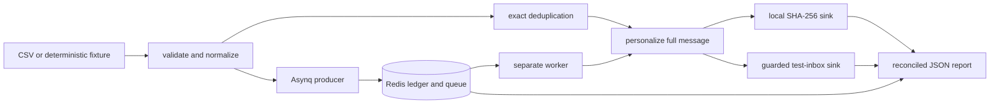

# Personalized email pipeline

This repository is a proof of concept for processing one million personalized promotional emails quickly and safely. The default command renders every message and consumes it through an in-memory SHA-256 sink. It does not contact an email server. Optional modes demonstrate bounded test-inbox delivery and Asynq/Redis execution without changing the default path.

A recipient is complete only after the full personalized message has been rendered and accepted by the selected sink.

## Table of contents

- [Assignment fit](#assignment-fit)
- [Design summary](#design-summary)
- [Build and quick start](#build-and-quick-start)
- [Small reproducible proof](#small-reproducible-proof)
- [Input contract](#input-contract)
- [Processing, safety, and privacy](#processing-safety-and-privacy)
- [Outcomes and accounting](#outcomes-and-accounting)
- [One-million-record proof](#one-million-record-proof)
- [Optional execution modes](#optional-execution-modes)
- [Test strategy and evidence](#test-strategy-and-evidence)
- [Limitations](#limitations)
- [Submission checklist](#submission-checklist)

## Assignment fit

The original task asks for a script or small page that handles a list of 1,000,000 customer email addresses, sends the same promotional message personalized with each recipient's name, finishes as fast as reasonably possible, and never emails real recipients.

| Assignment requirement | Implementation and evidence |
|---|---|
| Process 1,000,000 addresses | `generate --count 1000000` creates a deterministic CSV. `run` streams it through bounded worker queues. The recorded reference run completed all 1,000,000 records. |
| Personalize the same promotion | `internal/campaign/render.go` builds the same subject and 20% promotion for each eligible recipient. It uses `Hello <name>,` or the fixed `Hello there,` fallback. |
| Finish quickly | The reference run completed campaign processing in 3.123577 seconds on an Apple M3 Pro. Reproduction commands and machine details are documented below. |
| Do not email real recipients | The default sink is local and network-free. Optional SMTP accepts only a generated fixture of at most 10 records, requires an exact confirmation token, and sends every message to one independently allowlisted test destination. Fixture addresses use the reserved `.test` domain and are never transport destinations. |
| Provide working code | The repository contains the CLI, tests, CI workflow, deterministic test data, and repeatable benchmark commands. |
| Provide all AI prompts | This is a separate submission artifact. It is intentionally not reconstructed or claimed by this README. Export the complete original AI conversations and submit them alongside the repository link. |

The repository also covers malformed input, duplicates, cancellation, privacy-safe reports, partial failure, and optional distributed execution.

## Design summary



The default route is `CSV -> validate -> deduplicate -> render -> local sink -> report`. It opens no Redis or SMTP connection and does not read optional credentials. The Asynq route uses Redis as the durable accounting authority. Asynq transports work but does not decide whether a recipient is complete.

Repository layout:

| Path | Responsibility |
|---|---|
| `cmd/email-pipeline` | CLI parsing, safety preflight, command routing, process signals, and exit codes |
| `internal/recipientcsv` | Streaming CSV reader and deterministic PCG fixture generation |
| `internal/campaign` | Validation, deduplication, rendering, local coordination, accounting, and JSON reports |
| `internal/testinbox` | Mandatory-TLS SMTP adapter with confirmed, rejected, transport-failed, and indeterminate outcomes |
| `internal/distributed` | Asynq tasks, producer, worker, Redis ledger, atomic transitions, retries, and closure |
| `internal/testprivacy` | Subprocess checks that output and optional failures do not expose recipient or credential canaries |

## Build and quick start

Requires Go 1.26.5.

```sh
go build -trimpath -o bin/email-pipeline ./cmd/email-pipeline
bin/email-pipeline help
```

The default workflow is service-free:

```sh
bin/email-pipeline generate --output assessment-1000000.csv --count 1000000 --seed 7
bin/email-pipeline run --input assessment-1000000.csv
```

`generate` reports its own elapsed time and expected named/fallback counts. `run` measures only campaign processing: CSV parsing, validation, exact deduplication, full personalization, and acceptance by the local digest sink.

## Small reproducible proof

The checked-in golden fixture at `internal/recipientcsv/testdata/fixture-v1.csv` is generated with algorithm `v1`, seed `7`, and count `4`:

```csv
email,name
recipient-000001-7bb1665eece80fc6@example.test,Customer 000001
recipient-000002-00d2f693ce99a296@example.test,
recipient-000003-8d0c281e60fdd6e1@example.test,Customer 000003
recipient-000004-49d49bedc77508ec@example.test,
```

Recreate and process it:

```sh
bin/email-pipeline generate --output proof.csv --count 4 --seed 7
bin/email-pipeline run --input proof.csv --workers 2
```

The generation report states that the fixture has two named and two fallback records:

```json
{"outcome":"success","expected":{"algorithm":"v1","seed":7,"count":4,"named":2,"fallback":2}}
```

The run report includes these core fields. Timing and memory values vary by run, so they are omitted from this shortened example:

```json
{
  "outcome": "success",
  "accounting_scope": "full",
  "counts": {
    "examined": 4,
    "invalid": 0,
    "duplicate": 0,
    "eligible": 4,
    "started": 4,
    "completed": 4,
    "failed": 0,
    "unprocessed": 0
  },
  "samples": [
    {"ordinal": 1, "category": "named", "text": "Hello recipient-000001, [promotion rendered]"},
    {"ordinal": 2, "category": "fallback", "text": "Hello there, [promotion rendered for recipient-000002]"}
  ],
  "cancelled": false,
  "fatal": false
}
```

The samples prove that both personalization branches ran, but they use synthetic fixture-derived labels instead of supplied recipient data or full message bodies. The complete message consumed by the sink has this shape:

```text
Subject: Your exclusive offer

Hello Customer 000001,

Exclusive offer: save 20% on your next purchase.
```

## Input contract

- UTF-8 CSV with the exact header `email,name`.
- One record per physical line; `email` is required and `name` is optional.
- Quoted commas are supported; embedded newlines are not.
- A UTF-8 BOM is accepted only before the header.
- Each physical record is limited to 1 MiB.
- Recoverable malformed rows are counted by static reason and processing continues.
- Missing/wrong headers, open failures, and unreadable boundaries are fatal.

Email validity is deliberately conservative and offline. Surrounding Unicode whitespace is removed, comparison identities are lowercase, and provider-specific dot or plus-tag rewriting is never performed. Invalid rows do not reserve identities.

## Processing, safety, and privacy

Every first valid identity is rendered with the fixed promotion and either a usable supplied name or `Hello there,`. Dry-run completion is counted only after the full message is accepted by the SHA-256 digest sink. Test-inbox completion requires confirmed SMTP acceptance after `DATA`.

Reports never include supplied addresses, names, personalized bodies, raw parser errors, panic values, environment values, or credentials. Diagnostic examples use synthetic source-ordinal labels. Rendering samples retain the two lowest ordinals per represented category; invalid/failed reasons retain the three lowest ordinals and state how many details were omitted.

## Outcomes and exit codes

| Outcome | Exit | Meaning |
|---|---:|---|
| `success` | 0 | At least one eligible recipient, no invalid rows, and all eligible work completed. Duplicates alone do not downgrade success. |
| `failure` | 1 | Invalid configuration/input trust, empty or zero-eligible input, or untrustworthy accounting. |
| `partial_success` | 2 | Trustworthy accounting with invalid rows or eligible work failures/unprocessed work. |
| `interrupted` | 130 | First SIGINT/SIGTERM stopped admission and remaining trustworthy input was reconciled. |

The report enforces:

```text
examined = invalid + duplicate + eligible
eligible = completed + failed + unprocessed
started = completed + failed
```

`run` handles the first SIGINT/SIGTERM gracefully. Admission closes within the reported 100 ms response bound; started work receives the configured settlement duration (default 5 seconds). Reading of a trustworthy regular file continues in accounting-only mode, so total command completion can exceed the settlement duration. A second signal uses normal platform behavior.

## One-million-record proof

Generation and processing are intentionally separate:

```sh
/usr/bin/time -l bin/email-pipeline generate \
  --output assessment-1000000.csv --count 1000000 --seed 7 \
  > generate-report.json 2> generate-time.txt

/usr/bin/time -l bin/email-pipeline run \
  --input assessment-1000000.csv --workers 11 \
  > benchmark-report.json 2> benchmark-time.txt
```

On Linux, use `/usr/bin/time -v` and read `Maximum resident set size (kbytes)`. On macOS, `/usr/bin/time -l` reports `maximum resident set size` in bytes. The JSON field `peak_heap_inuse_bytes` is sampled Go `HeapInuse` at 10 ms intervals and is not RSS.

### Reference measurement (2026-07-27)

- Go: `go1.26.5 darwin/arm64`
- Machine: Apple M3 Pro, 11 logical CPUs, 19,327,352,832 bytes physical memory
- Fixture: algorithm `v1`, seed `7`, 1,000,000 records, 500,000 named and 500,000 fallback
- Fixture size/SHA-256: 55,500,012 bytes / `34c90f44002f2b0f7df2a5c937a03b4c7c5db6e3058ff401185f36ab62bb965c`
- Generation: 0.304050 seconds; 11,665,408-byte maximum RSS
- Processing: 3.123577 seconds with 11 workers and queue capacity 22
- Counts: 1,000,000 examined/eligible/started/completed; 0 invalid/duplicate/failed/unprocessed
- Input and primary completion throughput: 320,146 records/renderings per second
- Sampled peak Go `HeapInuse`: 233,775,104 bytes
- OS maximum RSS: 249,872,384 bytes

These figures are environment-specific evidence, not a hardware-independent SLA. Exact deduplication makes the normalized identity set the only input-sized structure.

## Optional execution modes

These modes are supporting demonstrations. They are not needed to build, test, or run the one-million-record proof.

`run` independently selects an execution backend and message sink. Omitted selectors are `--backend=local --sink=dry-run`.

| Backend | Sink | Input | External service |
|---|---|---|---|
| `local` | `dry-run` | Supplied CSV | None |
| `local` | `test-inbox` | Generated fixture, 1-10 records | SMTP |
| `asynq` | `dry-run` | Generated fixture | Standalone Redis |
| `asynq` | `test-inbox` | Generated fixture, 1-10 records | Standalone Redis and SMTP |

Test-inbox runs require the exact `--confirm-test-inbox=SEND_SYNTHETIC_TEST` flag. They deliver every rendered synthetic message to one independently configured allowlisted destination, never to generated fixture addresses.

```sh
export EMAIL_PIPELINE_SMTP_HOST=smtp.example.test
export EMAIL_PIPELINE_SMTP_PORT=587
export EMAIL_PIPELINE_SMTP_USERNAME=test-user
export EMAIL_PIPELINE_SMTP_PASSWORD='use-an-isolated-secret'
export EMAIL_PIPELINE_SMTP_FROM=sender@example.test
export EMAIL_PIPELINE_TEST_DESTINATION=inbox@example.test
export EMAIL_PIPELINE_TEST_ALLOWLIST=inbox@example.test
# Optional for an isolated SMTP server signed by a private test CA:
# export EMAIL_PIPELINE_SMTP_CA_FILE=/path/to/test-ca.pem

bin/email-pipeline run --backend=local --sink=test-inbox \
  --count=2 --seed=7 --confirm-test-inbox=SEND_SYNTHETIC_TEST
```

Distributed runs require standalone Redis and a separately started sink-specific worker:

```sh
docker run --rm --name email-pipeline-redis -p 6379:6379 redis:7-alpine

# in the shells that run the producer and worker
export EMAIL_PIPELINE_REDIS_ADDR=127.0.0.1:6379
export EMAIL_PIPELINE_REDIS_DB=0

# terminal 1
bin/email-pipeline worker --sink=dry-run --concurrency=4

# terminal 2
bin/email-pipeline run --backend=asynq --sink=dry-run \
  --count=10000 --seed=7 --task-size=100
```

For distributed test-inbox delivery, configure both Redis and SMTP, start `worker --sink=test-inbox`, and run:

```sh
bin/email-pipeline run --backend=asynq --sink=test-inbox \
  --count=2 --seed=7 --task-size=1 \
  --confirm-test-inbox=SEND_SYNTHETIC_TEST
```

Asynq task execution is at least once. Redis owns an atomic, non-reclaimable SMTP reservation, so redelivery cannot submit the same intended synthetic message twice. A reservation whose final SMTP state cannot be proven is reported as `delivery_indeterminate`; the tool does not claim exactly-once delivery. Redis ambiguity produces `accounting_scope:"unknown"` and never falls back to local execution.

## Test strategy and evidence

Run the local quality gates from the repository root:

```sh
test -z "$(gofmt -l .)"
git diff --check
go vet ./...
go test -count=1 ./...
go test -race -shuffle=on -count=1 ./...
```

The final feature-branch verification on 2026-07-28 produced:

| Check | Result |
|---|---|
| Standard suite | 130 tests passed across 6 packages |
| Race-enabled shuffled suite | 130 tests passed across 6 packages |
| Static analysis | `go vet ./...` passed |
| Formatting and patch checks | `gofmt -l .` and `git diff --check` produced no findings |
| Default-path smoke | Deterministic generate-then-run completed with balanced counts |
| Four-mode manual QA | Local dry-run, local test-inbox, Asynq dry-run, and Asynq test-inbox completed |
| SMTP test evidence | The isolated TLS catcher recorded four acceptances across the two bounded delivery runs |

The automated suite covers more than happy-path throughput:

- deterministic fixture bytes and generated-source parity;
- named and fallback personalization;
- malformed rows, conservative email validation, exact deduplication, and fatal input boundaries;
- reconciliation identities, partial success, sink failure, cancellation, and report validation;
- privacy canaries in stdout, stderr, optional configuration failures, Redis state, and task payloads;
- SMTP acceptance, rejection, TLS/configuration failure, and indeterminate post-submission transport state;
- Redis atomic state transitions, duplicate attempts, retries, exhaustion, campaign closure, and unknown-state reporting;
- real Asynq integration against standalone Redis.

CI keeps the default job service-free, proves poisoned optional endpoints do not affect local execution, and runs a 10,000-record end-to-end smoke test. A separate Redis job exercises the ledger and Asynq integration tests. SMTP protocol tests use an in-process TLS wire server and require no external credentials. `Dockerfile.bench` is an optional pinned Linux environment; Docker is not needed for normal use.

Re-run the commands above on the review machine and compare counts and accounting invariants rather than elapsed time.

## Limitations

- The benchmark measures a proof of processing and sink acceptance, not provider delivery to one million inboxes.
- The default sink hashes complete rendered messages instead of retaining them. This keeps memory bounded while proving the render path ran.
- Email syntax checks are deliberately conservative and offline. The program does not verify mailbox existence or deliverability.
- Exact deduplication retains normalized identities, so memory grows with the number of unique valid recipients.
- SMTP delivery is limited to a deliberate test-inbox mode. The project does not implement campaign authoring, unsubscribe handling, scheduling, deliverability operations, or analytics.
- Asynq is at least once. Redis application state makes accounting idempotent, while the SMTP reservation prevents automatic duplicate submission. An unresolved post-submission crash is reported as indeterminate rather than retried.
- The recorded performance number is specific to Go 1.26.5 on an Apple M3 Pro.

## Submission checklist

The assignment requests two deliverables:

1. Share this repository at the final `main` commit and confirm the link is publicly viewable.
2. Export the complete AI conversations from the first prompt through the final response and attach them or share a public link.

Before sending:

- rerun the four quality-gate commands in [Test strategy and evidence](#test-strategy-and-evidence);
- confirm `main` contains the complete commit history and the working tree is clean;
- check that no credential, private recipient list, generated benchmark artifact, or confidential email attachment is committed;
- include assumptions and measured environment details rather than presenting the PoC as a production email platform.
