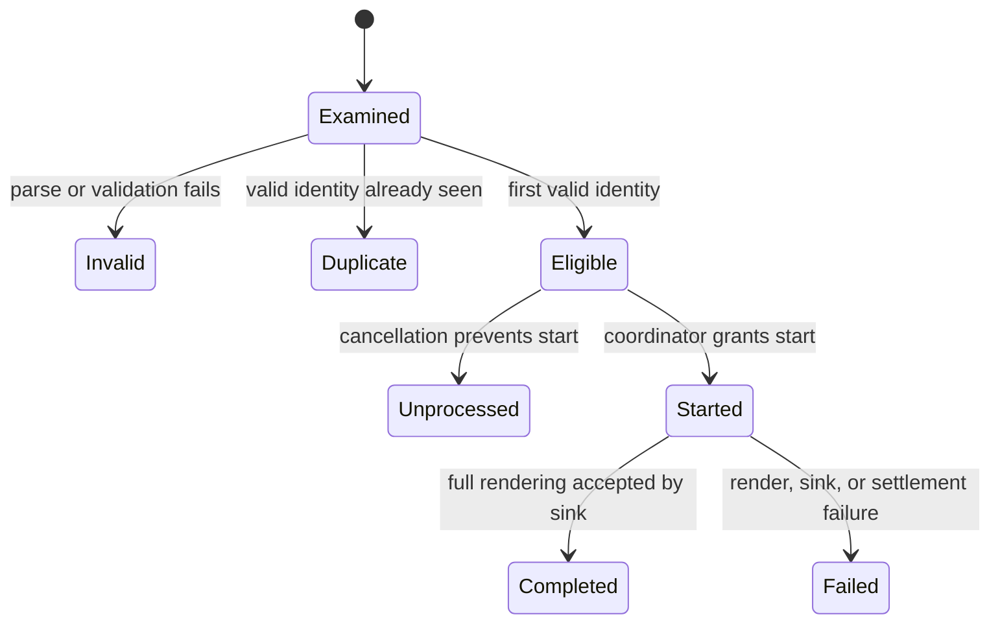
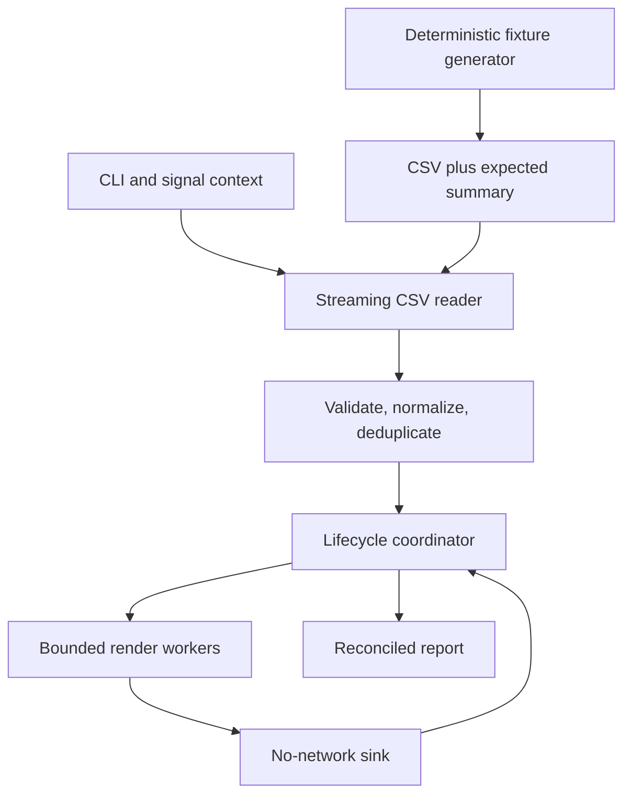
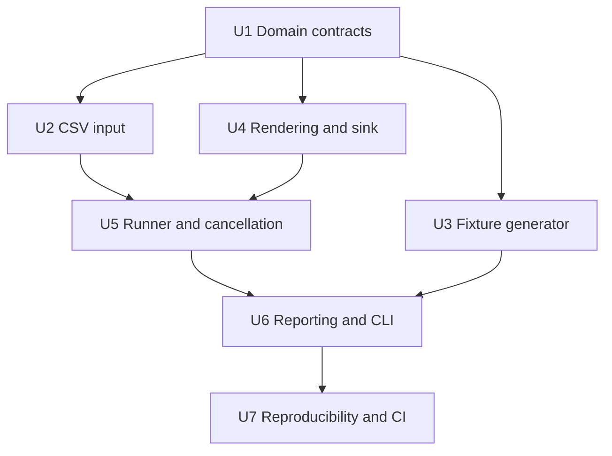

# feat: Build the million-recipient dry-run pipeline

## Summary

Build a standard-library Go CLI with two commands: deterministic CSV generation and local campaign processing. The processing path streams input, deduplicates conservatively, renders every eligible message through a no-network sink, bounds concurrency and diagnostics, and emits privacy-safe correctness and performance evidence. It fully reconciles trustworthy input and reports only a trustworthy prefix when fatal corruption prevents full reconciliation.

---

## Problem frame

The repository currently contains only its module declaration, README title, and the reviewed requirements. The evaluator needs a safe local proof that one million records undergo real personalization work, not a production campaign platform or a validation-only throughput loop. See the [origin requirements](../brainstorms/2026-07-26-personalized-email-campaign-requirements.md).

---

## Requirements

The origin remains authoritative. These traces preserve its IDs rather than redefining behavior.

- R1-R6: accept a documented CSV file, generate deterministic fixtures, apply fallback naming, validate conservatively, and deduplicate only valid normalized identities.
- R7-R10: render the fixed promotion for every eligible recipient, consume it through a no-network sink, bound concurrency, and handle operator cancellation with visible response and settlement limits.
- R11-R15: derive one terminal outcome, maintain both reconciliation identities, bound and redact every diagnostic surface, retain deterministic category samples, and report reproducible timing, throughput, stage, and memory evidence.
- R16-R18: keep optional infrastructure isolated. This plan intentionally omits distributed execution and network delivery rather than weakening the required path with unused extension points.

**Origin actors:** A1 Evaluator, A2 Operator. A3 Test delivery environment remains outside the active implementation because test delivery is deferred.

**Origin flows:** F1 Required local dry run, F2 Graceful cancellation, F3 Reproducible million-record demonstration. F4 is addressed by documenting why its optional demonstrators are absent.

**Origin acceptance examples:** AE1-AE10 and AE13-AE16 are enforced by active implementation and tests. AE11 and AE12 are satisfied by the absence and isolation of network delivery and Redis requirements; their optional-mode refusal branches are deferred because those modes do not exist in this submission.

---

## Scope boundaries

- No web UI, database, cloud deployment, campaign authoring, scheduling, analytics, unsubscribe handling, or deliverability operations.
- No network delivery path, SMTP/provider SDK, mailbox lookup, DNS validation, or destination credentials.
- No Redis, Asynq, custom broker, or distributed execution.
- No provider-specific dot, plus-tag, or alias rewriting.
- No persistence of all rendered messages and no exactly-once claim.
- No hardware-independent completion-time SLA.
- No abstraction introduced solely to support a possible future queue or delivery mode.

### Deferred to follow-up work

- Asynq/Redis demonstration: reconsider only if an evaluator explicitly requests distributed execution or a measured single-process bottleneck cannot be addressed by the bounded local pipeline.
- Guarded test-inbox delivery: reconsider only if a network-delivery demonstration becomes an explicit deliverable. It would require a separate mode, confirmation, independent allowlist, recipient-set exclusion check, synthetic payloads, a hard volume cap, credential isolation, and its own acceptance status.
- Portable process peak RSS collection: keep platform-specific collection in benchmark instructions unless Go or the target environment exposes a reliable portable process-peak API.

---

## Context and research

### Relevant code and patterns

- `go.mod` sets module `github.com/irvankadhafi/personalized-email-pipeline` and Go 1.26.5.
- `README.md` has no established CLI or architecture conventions to preserve.
- No application packages, tests, `AGENTS.md`, `CLAUDE.md`, `STRATEGY.md`, or `docs/solutions/` patterns exist in the repository.

### Institutional learnings

- None are present. The plan therefore makes lifecycle, privacy, and CLI contracts explicit instead of assuming local conventions.

### External guidance used

- Go `encoding/csv` for per-record parsing, `context` and `os/signal.NotifyContext` for cancellation, and bounded channel pipelines for backpressure.
- Go race detection, fuzzing, benchmarks, and runtime memory statistics for verification and evidence.
- Asynq's at-least-once processing and Redis dependency were evaluated. They add retry, idempotency, payload, outage, and setup concerns without improving required acceptance, so they are not active work.

---

## Key technical decisions

| Decision | Resolution and rationale |
|---|---|
| Required path | One process, standard library only. This is the smallest path that demonstrates the required work and has no external failure domain. |
| Commands | `generate` writes a fixture and expected summary; `run` processes an existing file. Separate commands keep generation time outside campaign-processing time without inventing a combined mode. |
| Input dialect | UTF-8 CSV with header `email,name`, one record per physical line, optional `name`, quoted commas allowed, embedded newlines forbidden, and a 1 MiB record limit. Physical-line framing makes malformed rows recoverable without trusting a damaged multi-line quote state. |
| Validation | Trim surrounding Unicode whitespace; require one conservative ASCII email shape with one `@`, non-empty bounded local/domain parts, no control/space characters, and valid dot-separated domain labels. Do not use network checks or provider-specific rewriting. |
| Identity | Lowercase the trimmed validated address only for comparison. Keep no normalized identity for an invalid record. |
| Memory posture | Stream records and outputs. The deduplication set is the only input-sized structure. Work queues, in-flight state, samples, and diagnostic details remain bounded. |
| Concurrency | Default workers to `GOMAXPROCS`; use a queue bounded to twice the worker count. A sequential reader owns parse/validation/dedup decisions; a coordinator owns lifecycle counts; workers only render and submit sink results. |
| Lifecycle linearization | A worker must receive a coordinator-issued start grant before rendering. After cancellation or fatal-input detection, the coordinator issues no new grants and marks ungranted queued items unprocessed. Sink acceptance carries its monotonic acceptance time; acceptance at or before the settlement deadline completes the item even if its event is received later. |
| Cancellation | First SIGINT/SIGTERM is the request point. The reported response interval runs from signal-context observation until the coordinator closes the start-grant gate and must not exceed 100 ms. Started work may settle for a configurable deadline, default 5 seconds. The reader continues in accounting-only mode so the remaining regular-file records become invalid, duplicate, or eligible-unprocessed. |
| Fatal-input precedence | A fatal source error detected before terminal commit produces failure even if cancellation was also requested, because full reconciliation is no longer trustworthy. Fatal detection closes the start-grant gate, marks ungranted queued items unprocessed, and starts the same configurable settlement duration from the fatal-detection instant. The report records any cancellation request and limits accounting claims to a trustworthy prefix. |
| Terminal commit | The coordinator atomically freezes terminal buckets and outcome after trustworthy input classification and eligible settlement. Cancellation before this point participates in settlement and yields interrupted unless fatal failure wins; a signal observed after it cannot rewrite the committed campaign outcome. |
| Outcome precedence | Fatal/untrustworthy accounting → failure; otherwise cancellation → interrupted; otherwise zero eligible → failure; otherwise any invalid or failed eligible record → partial success; otherwise success. Duplicates alone do not downgrade success. |
| Sampling | Keep the two lowest source ordinals per represented personalization category and the three lowest ordinals per invalid/failed reason using bounded top-k retention, then sort by ordinal for output. Samples use synthetic labels such as `recipient-000042`; no hash or transformation of supplied PII appears. Reports include omitted-detail counts. |
| Memory evidence | Sample Go `HeapInuse` every 10 ms during campaign processing and label it `peak_heap_inuse_bytes`, not RSS. The repeatable benchmark separately records OS peak RSS with platform-specific tooling and labels its units and environment. |
| Timing | Processing starts immediately before input consumption and ends after input classification is complete and every eligible item is in a terminal bucket, before report formatting. Both throughputs use this elapsed duration, including any accounting-only drain after cancellation. Generation timing is emitted by `generate`, not folded into processing. |
| Exit codes | Success 0, failure 1, partial success 2, interrupted 130. Emit a privacy-safe terminal report whenever enough state exists to do so. |

### CSV error policy

- A physical line with the wrong field count, invalid quoting, invalid UTF-8, an oversized field/record, a missing email, or a syntactically invalid email is one recoverable invalid record when its newline boundary is known.
- Blank physical lines are recoverable invalid records. A UTF-8 BOM is accepted only before the header.
- Missing/wrong headers, file-open failures, non-EOF read failures, or any condition that prevents finding the next physical record boundary are fatal input errors.
- A fatal error before the first accepted data record reports no campaign work. A fatal error later preserves prefix counts, marks them `prefix-only`, and does not claim full-input reconciliation.

### Record lifecycle and ownership

The following is directional guidance for review, not implementation specification.



Only the sequential input stage mutates the deduplication set. Only the coordinator commits `eligible`, `started`, `completed`, `failed`, and `unprocessed` transitions. A worker cannot begin rendering until the coordinator grants `started`; once admission closes, every ungranted queued item becomes `unprocessed`. The coordinator tracks only bounded queued/in-flight work, not one lifecycle object per recipient. Sink results include a monotonic acceptance time, with acceptance at or before the deadline taking precedence over delayed event receipt. Results for items already terminal remain inert.

---

## Open questions

### Resolved during planning

- Input format: the constrained physical-line CSV dialect above preserves streaming and deterministic recovery.
- Cancellation defaults: 100 ms admission-response maximum and 5 second settlement deadline, both visible in reports; the settlement deadline is configurable for deterministic testing and evaluator needs.
- Diagnostic bounds: the lowest two source ordinals per rendering category and lowest three per reason, with ordinal synthetic placeholders and omission totals.
- Peak memory: report sampled Go heap in-process and obtain peak RSS externally in the benchmark procedure; never conflate the two.
- Optional isolation: omit Asynq/Redis and delivery code, dependencies, flags, interfaces, CI services, and placeholder configuration entirely.

### Deferred to implementation

- Exact internal symbol names and package-private data shapes may change if the planned ownership boundaries are clearer with fewer names.
- The fixed promotional copy may be finalized while implementing rendering, provided named and fallback greetings remain observable and tests assert full render/sink work rather than exact marketing prose.
- The benchmark records measured results from the actual evaluator/reference machine; the plan specifies measurement semantics, not invented numbers.

---

## Output structure

```text
.
├── .github/workflows/ci.yml
├── Dockerfile.bench
├── .gitignore
├── README.md
├── cmd/email-pipeline/
│   ├── main.go
│   └── main_test.go
├── internal/campaign/
│   ├── model.go
│   ├── model_test.go
│   ├── normalize.go
│   ├── normalize_test.go
│   ├── render.go
│   ├── render_test.go
│   ├── report.go
│   ├── report_test.go
│   ├── runner.go
│   └── runner_test.go
├── internal/recipientcsv/
│   ├── fixture.go
│   ├── fixture_test.go
│   ├── reader.go
│   ├── reader_fuzz_test.go
│   ├── reader_test.go
│   └── testdata/
│       ├── fixture-v1.csv
│       └── fixture-v1-summary.txt
└── internal/testprivacy/privacy_test.go
```

The tree is a scope declaration. Per-unit file lists are authoritative, and implementation may merge a tiny file when doing so preserves the stated ownership boundaries.

---

## High-level technical design

This illustrates the intended approach and is directional guidance for review, not implementation specification.



Normal processing applies backpressure at the bounded queue. Workers request a start grant from the coordinator before rendering. On cancellation or fatal input, the coordinator closes that gate, settles granted work only until the applicable deadline, marks ungranted queued jobs `unprocessed`, and, when input boundaries remain trustworthy, lets the input stage continue classifying the regular file without dispatching new jobs. This preserves both reconciliation identities without retaining all records.

---

## Implementation units



### U1. Define recipient, outcome, and privacy contracts

**Goal:** Establish the small domain vocabulary that every stage shares: recipient classification, conservative identity, lifecycle counts, failure reasons, outcome rules, sample categories, and privacy-safe diagnostic references.

**Requirements:** R3-R6, R11-R14; F1; AE2-AE6, AE13, AE14, AE16.

**Dependencies:** None.

**Files:**
- Create: `internal/campaign/model.go`
- Create: `internal/campaign/normalize.go`
- Test: `internal/campaign/model_test.go`
- Test: `internal/campaign/normalize_test.go`

**Approach:**
- Represent terminal outcome and reason categories as closed domain values, not free-form strings assembled throughout the pipeline.
- Keep supplied email/name values inside the shortest-lived recipient object needed for rendering. Diagnostic records carry only input ordinal, synthetic category label, and non-sensitive reason.
- Apply normalization after validity succeeds. Invalid records never enter the identity set.
- Define outcome derivation and the two reconciliation checks as domain invariants. Negative or unbalanced counts make accounting untrustworthy and prevent a compliant report.
- Trim surrounding Unicode whitespace from names. A remaining blank name uses the fixed neutral greeting. Control characters are not copied into rendered or diagnostic output.

**Patterns to follow:**
- Go standard-library value types and table-driven tests; no validation dependency or one-implementation interface.

**Test scenarios:**
- Covers AE2. Happy path: usable and whitespace-only names classify into named and fallback categories without deriving a name from the address.
- Covers AE3. Happy path: valid addresses differing only by outer whitespace or case produce one identity.
- Covers AE4. Edge case: plus-tags and provider-specific dot variants remain distinct identities.
- Covers AE5. Error path: an invalid first occurrence does not reserve an identity; a later valid occurrence remains eligible.
- Covers AE13. Edge case: zero eligible records derives failure, while one eligible record with all work failed and balanced counts derives partial success.
- Covers AE14. Error path: either reconciliation mismatch or a negative count marks accounting untrustworthy and prevents a compliant success/partial/interrupted result.
- Covers AE16. Privacy: supplied name, address, and body fragments cannot be recovered from serialized domain diagnostics or their formatted errors.

**Verification:**
- Outcome and identity behavior are deterministic, both reconciliation equations are mandatory, and no diagnostic type accepts raw supplied PII.

### U2. Stream and classify constrained CSV input

**Goal:** Read evaluator files with bounded record memory, recover at known physical-line boundaries, and produce examined records or a fatal source condition without loading the file.

**Requirements:** R1, R3-R6, R12, R13; F1, F2; AE1, AE3-AE6, AE15, AE16.

**Dependencies:** U1.

**Files:**
- Create: `internal/recipientcsv/reader.go`
- Test: `internal/recipientcsv/reader_test.go`
- Test: `internal/recipientcsv/reader_fuzz_test.go`

**Approach:**
- Document and enforce the `email,name` physical-line CSV dialect, BOM/header rules, UTF-8 requirement, and 1 MiB maximum record size.
- Frame input with `bufio.Reader.ReadSlice('\n')` fragments: retain fragments only through the 1 MiB limit, then discard further fragments through the next newline without concatenation and return exactly one oversized invalid record. Validate UTF-8 on the bounded assembled row before parsing it with `encoding/csv`.
- Return typed reason categories and ordinals, never raw parser errors or offending line content. Wrap source failures with static privacy-safe context.
- Keep reading after cancellation in accounting-only mode when the source is still trustworthy. Classification continues, but eligible records are handed to the coordinator as never admitted/unprocessed.
- Treat open/header/read/boundary failures as fatal and preserve whether zero records or a trustworthy prefix was accepted.

**Execution note:** Implement parser classification and fatal/prefix behavior test-first because they define the trust boundary for all downstream accounting.

**Patterns to follow:**
- `bufio.Reader` for bounded physical-line framing and `encoding/csv` for field parsing. Do not use `bufio.Scanner` with an implicit token ceiling or a whole-file reader.

**Test scenarios:**
- Covers AE1. Happy path: a header and valid unique rows stream in source order with email required and name optional.
- Covers AE3. Integration: case/whitespace variants reach U1 normalization and the later valid occurrence becomes duplicate.
- Covers AE5. Error path: an invalid quoted row with a known newline boundary becomes one invalid record and the following valid row is still read.
- Covers AE6. Edge case: many malformed and oversized rows retain complete reason totals while detail retention remains bounded downstream.
- Covers AE15. Error path: wrong/missing header or a source failure before data produces fatal failure with no campaign work; the same read failure after valid rows reports a trustworthy prefix only.
- Edge case: BOM before the header is accepted; BOM in data, blank lines, extra fields, invalid UTF-8, missing email, and embedded newline attempts are classified according to the documented dialect.
- Covers AE16. Fuzz/privacy: arbitrary byte input, including a conceptual newline-free stream represented by repeated fragments, never panics, retains more than the record bound because of one record, or returns raw input bytes through errors/diagnostics.

**Verification:**
- Large files are consumed incrementally, recoverable rows cannot desynchronize later rows, and fatal conditions expose no supplied content.

### U3. Generate deterministic assessment fixtures

**Goal:** Generate exact ordered CSV fixtures and expected summaries from declared seed, count, and options, including named and fallback branches.

**Requirements:** R2, R3, R13-R15; F3; AE2, AE9, AE10.

**Dependencies:** U1.

**Files:**
- Create: `internal/recipientcsv/fixture.go`
- Test: `internal/recipientcsv/fixture_test.go`
- Test fixture: `internal/recipientcsv/testdata/fixture-v1.csv`
- Test fixture: `internal/recipientcsv/testdata/fixture-v1-summary.txt`

**Approach:**
- Define fixture algorithm `v1` as the standard-library `math/rand/v2` PCG source. Initialize its two 64-bit state values from the declared seed and a fixed documented second-state constant, and include `v1` in generation parameters and summaries. Do not use global random state, wall time, maps for output order, or host-specific data.
- Stream rows directly to the output writer and calculate the expected summary in the same deterministic sequence.
- Commit a tiny golden fixture and expected summary for the declared algorithm version. Before benchmark evidence is accepted, process generated bytes through the real reader/classifier and compare every category count with the generator summary without reusing generator-side counting helpers.
- Make the default assessment distribution explicit and stable: both named and blank-name rows must occur for any documented assessment-sized fixture. Options that alter validity or duplication proportions are declared in the generation summary.
- Report generation elapsed time and fixture parameters separately. Do not claim processing throughput from generation.

**Patterns to follow:**
- Standard-library CSV writing and explicit injected writer/clock seams only where tests need determinism; no fixture framework.

**Test scenarios:**
- Covers AE2. Happy path: the documented assessment options produce both named and fallback recipients.
- Covers AE9. Determinism: identical seed/count/options produce byte-identical ordered CSV and identical expected summaries across repeated runs.
- Covers AE9. Contract stability: the named algorithm/version reproduces the committed golden fixture byte-for-byte.
- Covers AE9. Edge case: a changed declared seed or generation option predictably changes output while preserving the documented summary equations.
- Edge case: zero count emits a valid header and zero summary; invalid count/options fail before creating a misleading complete fixture.
- Covers AE10. Scale behavior: a large generation test/benchmark writes incrementally and retains no record-sized collection.

**Verification:**
- The fixture is reproducible from reported parameters, and an independent reader/classifier oracle proves its emitted bytes match the expected summary.

### U4. Render and consume messages without network capability

**Goal:** Perform full named/fallback personalization for each eligible recipient and count completion only after a no-network sink accepts the rendered output.

**Requirements:** R3, R7-R9, R13, R14; F1; AE1, AE2, AE7, AE10, AE16.

**Dependencies:** U1.

**Files:**
- Create: `internal/campaign/render.go`
- Test: `internal/campaign/render_test.go`

**Approach:**
- Keep the promotion template fixed in the campaign package. Render the complete message into a reusable per-worker buffer or bounded value, then pass it to a concrete dry-run sink that performs deterministic local consumption (for example, byte count plus checksum) without retaining content.
- A rendering becomes completed only after sink acceptance. Render and sink failures use closed, non-sensitive reason categories.
- Produce privacy-safe evidence by rendering a synthetic ordinal placeholder through the same named/fallback branch; never redact a real rendering after the fact. Concurrent evidence retention uses the lowest source ordinals, not worker completion order.
- Avoid a transport interface and avoid imports that can dial a network. A small function seam for a failing test sink is enough to exercise AE7.

**Execution note:** Start with behavior tests that distinguish validation, render completion, and sink acceptance.

**Patterns to follow:**
- `text/template` or direct standard-library formatting, chosen during implementation by whichever yields the smaller clear fixed-message path; worker-local buffer reuse if benchmarks show allocation pressure.

**Test scenarios:**
- Covers AE1. Happy path: each eligible record produces a full message and only sink acceptance returns completed.
- Covers AE2. Happy path: named and fallback greetings differ as documented; synthetic evidence shows both without supplied PII.
- Covers AE7. Error path: a sink rejection after successful rendering returns a failed reason and never increments completion.
- Edge case: names containing surrounding whitespace or control characters cannot alter report structure or leak unsafe content.
- Covers AE16. Privacy: raw supplied rendering is never retained in a sample, failure, log value, or sink result.
- Covers AE10. Benchmark: rendering plus sink consumption is included in the measured worker operation, preventing a validation-only benchmark.

**Verification:**
- The only active sink is local and non-networking, and completion proves both full rendering and sink consumption occurred.

### U5. Coordinate bounded processing and cancellation

**Goal:** Join input classification, deduplication, bounded workers, sink results, and cancellation into one race-free lifecycle with exact terminal accounting.

**Requirements:** R4-R12, R15; F1, F2; AE1, AE3-AE8, AE10, AE13-AE15.

**Dependencies:** U2, U4.

**Files:**
- Create: `internal/campaign/runner.go`
- Test: `internal/campaign/runner_test.go`

**Approach:**
- Keep validation/dedup sequential and dispatch only first valid identities. Bound workers to the configured count and the queue to twice that count.
- Route admission, coordinator-issued start grants, and terminal events through one coordinator. Maintain only bounded queued/in-flight IDs plus aggregate counts and bounded evidence. A worker may render only after receiving its grant.
- On cancellation, record the request time once, close the grant gate within the 100 ms reported bound, continue reader classification without dispatch, mark all ungranted queued jobs unprocessed, and allow granted jobs to settle until the 5 second default deadline.
- At settlement expiry, cancel worker operation and classify remaining granted IDs once as failed due to interruption. Sink results carry monotonic acceptance times; acceptance at or before the deadline wins even if receipt is delayed, while results for already-terminal IDs are ignored.
- On fatal source corruption, record fatal detection as a separate settlement epoch, close the grant gate immediately, mark ungranted queued items unprocessed, and give granted prefix work the configured settlement duration measured from fatal detection. Remaining granted items become failed. Failure supersedes interrupted, accounting is prefix-only, and full-input reconciliation/performance claims are suppressed.
- Atomically commit terminal buckets and outcome after classification and settlement. Cancellation observed after that commit cannot change the outcome.
- Sample `HeapInuse` every 10 ms for the duration of campaign processing. Stop and join the sampler before finalizing metrics.

**Execution note:** Implement controlled race and cancellation tests before optimizing throughput. Run these tests with the race detector throughout implementation.

**Patterns to follow:**
- Go pipeline cancellation with `context.Context`, bounded channels, `sync.WaitGroup`, and one owner for mutable accounting. No shared atomic counters spread across workers.

**Test scenarios:**
- Covers AE1. Integration: valid unique rows pass through parse, render, sink, and balanced success with bounded queue depth.
- Covers AE3-AE6. Integration: duplicates, provider-distinct addresses, recoverable invalid rows, and multiple reason groups reconcile while valid work proceeds.
- Covers AE7. Error path: injected sink failures move started items only to failed and derive partial success.
- Covers AE8. Cancellation race: controlled blocked admission, worker pickup, render completion, sink acceptance, and settlement expiry produce exactly one terminal bucket per eligible item; no admission occurs beyond the response bound; result is interrupted.
- Covers AE8. Linearization: delayed start-grant and result delivery cannot turn rendering work into unprocessed or turn pre-deadline sink acceptance into failed; acceptance exactly at the deadline completes.
- Covers AE8. Terminal boundary: cancellation immediately before terminal commit yields interrupted, while cancellation immediately after commit leaves the committed outcome unchanged.
- Covers AE8. Edge case: cancellation during saturated queueing and cancellation before the first eligible record still drain trustworthy input and balance examined/eligible/unprocessed counts.
- Covers AE13. Outcome: empty/zero-eligible input is failure; all eligible sink failures with trustworthy accounting is partial success.
- Covers AE15. Fatal source failure before work reports no campaign work; after a valid prefix it marks ungranted queued work unprocessed, settles granted work from the fatal-detection epoch, labels prefix-only, and makes no full reconciliation claim.
- Concurrency: repeated randomized scheduling under the race detector never deadlocks, leaks worker/sampler goroutines, double-counts late results, or exceeds the configured queue plus worker in-flight bound.
- Determinism: repeated randomized worker scheduling produces byte-identical bounded sample sections ordered by source ordinal.
- Memory: diagnostic/sample/in-flight structures remain fixed-size as input grows; only the deduplication set scales with unique valid identities.

**Verification:**
- Every trustworthy run satisfies both equations, cancellation obeys its two reported bounds, and race-enabled tests pass without lifecycle ambiguity.

### U6. Emit reports and expose the CLI

**Goal:** Provide evaluator-facing `generate` and `run` commands, signal handling, stable outcomes/exit codes, and complete privacy-safe terminal evidence.

**Requirements:** R1-R3, R8, R10-R15, R18; F1-F3; AE1, AE2, AE6, AE8-AE10, AE13-AE16.

**Dependencies:** U3, U5.

**Files:**
- Create: `internal/campaign/report.go`
- Create: `internal/campaign/report_test.go`
- Create: `cmd/email-pipeline/main.go`
- Test: `cmd/email-pipeline/main_test.go`

**Approach:**
- Parse subcommands with `flag.FlagSet`. `generate` accepts output, count, seed, and declared fixture options. `run` accepts input, worker count, settlement deadline, and fixed diagnostic bounds where configuration is required.
- Before starting campaign timing, `run` opens and stats the input, rejects non-regular files such as FIFOs and devices with a static privacy-safe configuration error, and passes only an already-opened regular file to the reader and runner.
- Use `signal.NotifyContext` for SIGINT/SIGTERM and restore signal handling on exit. A second signal may force process termination through normal platform behavior; document that only the first signal receives graceful handling.
- Install a mandatory top-level panic boundary around command execution. It emits only a static categorized failure, suppresses the panic value and stack trace, and exits 1. Unrecoverable runtime faults may still terminate without a compliant report and are documented as such.
- Print one terminal report with outcome, accounting scope, all required counts and reason groups, bounds, stage counts, processing elapsed time, sampled peak heap, both throughput rates, proportions, and bounded samples/omission totals.
- Validate report invariants before formatting. If accounting is untrustworthy, emit only a minimal redacted failure report, omit reconciliation/performance claims, and exit as failure.
- Keep operational errors static and categorized. Never print raw parser errors, recipient values, personalized bodies, command environment, credentials, or stack traces containing supplied data.
- `generate` reports generation elapsed and expected summary. The README's two-command procedure supplies separate generation and processing evidence, so no combined command is needed.

**Patterns to follow:**
- Standard-library `flag`, `os/signal`, deterministic text formatting, and command functions that accept I/O streams for tests.

**Test scenarios:**
- Covers AE1. CLI integration: valid supplied CSV exits 0 with success, all required counts, both rates, stage counts, heap metric, bounded category evidence, and no network prerequisite.
- Covers AE2. CLI output: deterministic synthetic samples distinguish named/fallback greetings but contain no supplied names, addresses, or raw body.
- Covers AE6. CLI output: reason totals are complete, per-reason detail counts are bounded, and omitted counts are explicit.
- Covers AE8. Signal/cancellation integration: first cancellation yields exit 130, interrupted outcome, visible response/settlement bounds, and balanced trustworthy accounting.
- Covers AE9. Generate command: repeated parameters emit the same fixture/expected summary and a separate generation duration.
- Covers AE10. Report contract: processing elapsed is the common denominator for examined and completed rates; completion throughput is labelled primary; proportions and environment fields are present.
- Covers AE13. Exit contract: empty/zero eligible exits 1; all eligible failed with trustworthy counts exits 2; normal partial success exits 2.
- Covers AE14. Error path: a deliberately imbalanced report cannot be formatted as compliant and emits no performance claim.
- Covers AE15. Fatal input after a prefix exits 1, labels prefix-only, preserves trustworthy prefix counts, and omits full-input reconciliation.
- Covers AE16. Privacy scan: identifiable names, addresses, message fragments, parser text, failure text, and credential-like values injected through every command path are absent from stdout, stderr, and persisted report fixtures.
- Covers AE16. Panic privacy: subprocess tests inject panics carrying PII and credential canaries at parser, renderer, sink, and reporter seams; stdout/stderr contain only the static failure category and no panic value or stack trace.
- CLI edge cases: unknown command, invalid flags, nonexistent input, invalid worker/deadline values, and unwritable output fail predictably without partial-success wording or leaked paths/content.
- CLI edge case: FIFO, device, directory, and other non-regular input paths are rejected before processing begins.

**Verification:**
- A user can discover both commands through help, script outcomes through documented exit codes, and trust that every report is either reconciled or explicitly limited/minimal.

### U7. Document and automate reproducible evidence

**Goal:** Make correctness, race safety, privacy, and the one-million-record performance demonstration repeatable on a declared environment without external services.

**Requirements:** R2, R8, R13-R16, R18; F3, F4; AE9-AE12, AE16.

**Dependencies:** U6.

**Files:**
- Modify: `.gitignore`
- Modify: `README.md`
- Create: `.github/workflows/ci.yml`
- Create: `Dockerfile.bench`
- Create: `internal/testprivacy/privacy_test.go`

**Approach:**
- Replace the placeholder README with build/use examples, CSV contract, fixture options, outcome/exit semantics, cancellation behavior, privacy limits, reason/sample bounds, and a two-command one-million-record procedure.
- Document timing boundaries and distinguish generation duration, campaign-processing duration, sampled Go peak heap, and external process peak RSS. Include Linux and macOS RSS collection examples with units and state that results are environment-specific.
- Record the reference run's Go version, OS/architecture, CPU, logical processors/worker count, memory, fixture parameters, command configuration, and disclosed invalid/duplicate/failed/unprocessed proportions. Do not commit fabricated benchmark numbers; populate measured values during implementation verification.
- Provide `Dockerfile.bench` only as an optional pinned Linux benchmark environment. The normal build/run and CI do not depend on Docker.
- CI runs formatting/vetting, unit/integration/fuzz-seed tests, the race-enabled suite, and a bounded benchmark smoke test. It must not start Redis or any network delivery service.
- CI enforces that required runtime packages do not import dial-capable networking packages (`net`, `net/http`, `net/smtp`, or descendants) unless a future reviewed scope change removes the no-network invariant.
- Add a cross-package privacy test that drives representative command/report/error paths and scans all captured artifacts for supplied secrets and PII canaries.
- Run privacy-canary subprocesses with stdout/stderr redirected to workspace-local files. Scan and delete those files without printing or uploading their contents; failures emit fixed labels only.
- Add ignore rules for generated assessment fixtures, benchmark reports, and local canary captures so large or sensitive artifacts are not accidentally committed.
- State that Asynq/Redis and test delivery were deliberately omitted. Explain the revisit criteria and safeguards required if their scope changes.

**Execution note:** Capture performance numbers only after correctness, race, and privacy gates pass; benchmark evidence must use the full render-plus-sink path.

**Patterns to follow:**
- Minimal GitHub Actions Go workflow and a single-stage pinned Go benchmark image. Avoid release, deployment, coverage-service, or container-publishing scaffolding.

**Test scenarios:**
- Covers AE9. Reproducibility: following the documented generation procedure twice yields byte-identical fixtures and expected summaries; generation and processing measurements remain separate.
- Covers AE10. End-to-end: the one-million fixture runs without external services and emits balanced counts, full stage/performance fields, sampled heap, and bounded evidence; external tooling records labelled peak RSS on the reference platform.
- Covers AE10. Oracle parity: the documented procedure independently classifies the generated fixture and fails if any expected-summary count differs from the campaign report.
- Covers AE11. Safety: required commands expose no delivery flag or transport configuration and perform no network delivery when run without confirmation or inbox settings.
- Covers AE12. Isolation: all required build, test, and benchmark steps pass with Redis absent; no Asynq/Redis dependency exists in `go.mod`, CI, or required docs.
- Covers AE16. Privacy: the repository's persisted fixtures, benchmark output, CI logs under canary inputs, and error captures contain no recoverable supplied PII or credentials.
- Covers AE16. Artifact handling: canary captures are scanned before deletion and are never printed, uploaded, cached, or retained after the test.
- No-network regression: the required binary's dependency graph contains no dial-capable networking package, and the full CLI succeeds in a network-denied benchmark environment where supported.
- CI failure path: race, invariant, privacy, and benchmark-smoke regressions fail the workflow rather than being warning-only.

**Verification:**
- A fresh evaluator can reproduce correctness and measured evidence from README instructions using only Go and local disk; Docker remains optional.

---

## System-wide impact

- **Interaction graph:** CLI owns configuration and signal context; the CSV stage owns record boundaries and deduplication; the coordinator owns lifecycle state; workers own transient render buffers; the sink returns only acceptance metadata; the reporter consumes immutable aggregate evidence.
- **Error propagation:** Record-local failures become closed reason counts. Fatal source, invariant, and configuration failures terminate through privacy-safe categories. No raw external error crosses into user output.
- **State lifecycle risks:** The main risks are cancellation races, late worker results, prefix-only fatal input, and input-sized dedup memory. Single ownership, bounded in-flight tracking, run-scoped result identity, and explicit accounting scope address them.
- **API surface parity:** The CLI is the only public surface. Package APIs stay internal, so no compatibility layer or exported library contract is planned.
- **Integration coverage:** Cross-layer tests must prove parse → dedup → render → sink → report, cancellation drain/settlement, fatal-prefix handling, fixture-to-expected-summary parity, and output-surface privacy.
- **Unchanged invariants:** The Go module path and required no-infrastructure execution remain unchanged. Optional modes cannot alter required dependencies because no optional-mode code is included.

---

## Risks and dependencies

| Risk | Likelihood | Impact | Mitigation |
|---|---|---|---|
| One million unique identities consume substantial memory | Medium | High | Keep only the normalized identity set input-sized; benchmark it explicitly; document that exact deduplication has an unavoidable memory cost without external storage or sorting passes. |
| Cancellation accounting races with queue pickup or late sink completion | Medium | High | One coordinator grants starts, tracks only bounded active IDs, compares sink acceptance time to the cutoff, and makes terminal assignments once; stress delayed events under the race detector. |
| Accounting-only drain makes an interrupted run take longer than settlement | Medium | Medium | State this distinction in help/reporting: admission and started work obey bounds, while reading a trustworthy regular file continues to reconcile remaining records. |
| A blocked or failing file source prevents full drain | Low | High | `run` rejects non-regular input before timing. A later read failure becomes fatal/prefix-only, uses the fatal-detection settlement epoch, and makes no full reconciliation claim. |
| Parser errors leak raw CSV data | Medium | High | Convert errors at the reader boundary into closed reason codes and ordinal placeholders; fuzz and canary-scan all output surfaces. |
| Sampled heap understates process RSS | High | Medium | Label it as sampled `HeapInuse`, publish the 10 ms interval, and record OS peak RSS separately with platform and units. |
| Benchmark optimizations bypass actual rendering | Medium | High | Benchmark the same runner and sink used by `run`; completion remains downstream of full render and sink acceptance. |
| Docker or CI expands beyond assessment needs | Low | Low | Keep one optional benchmark image and one minimal Go workflow; no deployment, services, image publishing, or production infrastructure. |

Technical prerequisites are Go 1.26.5 and enough local disk/memory for the selected fixture. Redis, Docker, and network credentials are not prerequisites.

---

## Phased delivery

1. U1 establishes contracts and invariants.
2. U2, U3, and U4 can proceed after U1; they define input, fixtures, and actual personalization work.
3. U5 joins U2 and U4 into the bounded lifecycle and resolves cancellation.
4. U6 joins fixture and run paths at the CLI/report surface.
5. U7 records measured evidence and makes all gates repeatable.

---

## Success metrics

- AE1-AE10 and AE13-AE16 pass through active tests and end-to-end use.
- AE11's default no-delivery condition and AE12's Redis independence hold because those capabilities and dependencies are absent.
- A deterministic 1,000,000-record run balances both identities or explicitly reports a fatal prefix-only scope.
- Completion throughput measures full personalization plus dry-sink acceptance, using the same elapsed denominator as input throughput.
- Race-enabled cancellation tests and privacy canary scans pass.
- Peak heap and OS peak RSS are separately labelled and reproducible on the documented environment.

---

## Documentation and operational notes

- `README.md` is the evaluator runbook and must explain what is measured, what is not sent, how cancellation accounting works, and why optional modes are absent.
- Generated million-record fixtures, benchmark outputs, and canary captures are ignored by git. The tiny versioned golden fixture and summary under `internal/recipientcsv/testdata/` are the only committed fixture evidence.
- Progress output, if implementation proves it useful, must use aggregate counts only and update at a bounded interval. It is not required for acceptance and should be omitted if the terminal report is sufficient.
- Panic recovery is not a substitute for correct error handling. The CLI's mandatory top-level guard emits only a static privacy-safe failure and never prints the panic value or stack trace; unrecoverable runtime faults remain outside trustworthy-report guarantees.

---

## Alternative approaches considered

- Asynq/Redis workers: rejected for active scope because at-least-once retries introduce idempotency and operational concerns while Redis makes the evaluator path less portable.
- Guarded test-inbox delivery: rejected for active scope because absence of a network transport is safer and already demonstrates the required behavior. Adding it would create a separate security boundary without improving core acceptance.
- Whole-file loading: rejected because it weakens the million-record memory proof and cancellation backpressure.
- Multi-line RFC-style CSV: rejected because a malformed quote can make later record boundaries ambiguous. The documented physical-line dialect preserves recoverability with standard-library parsing.
- Persisting all rendered output: rejected because sink acceptance and bounded synthetic evidence prove personalization without storing a million potentially sensitive bodies.

---

## Sources and references

- **Origin document:** [docs/brainstorms/2026-07-26-personalized-email-campaign-requirements.md](../brainstorms/2026-07-26-personalized-email-campaign-requirements.md)
- **Module declaration:** `go.mod`
- Go package documentation: `encoding/csv`, `bufio`, `context`, `os/signal`, `runtime`, `runtime/metrics`, `testing`
- Go blog guidance: pipelines and cancellation
- Asynq documentation: task guarantees, retries, Redis prerequisites, and testing guidance used only for the deferral decision
