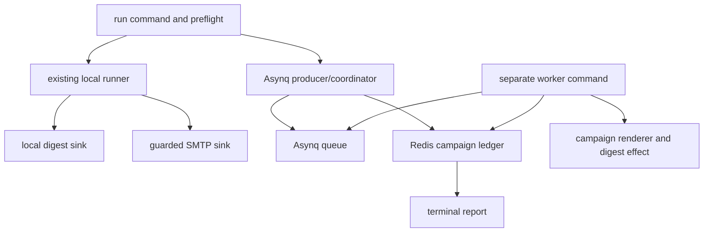
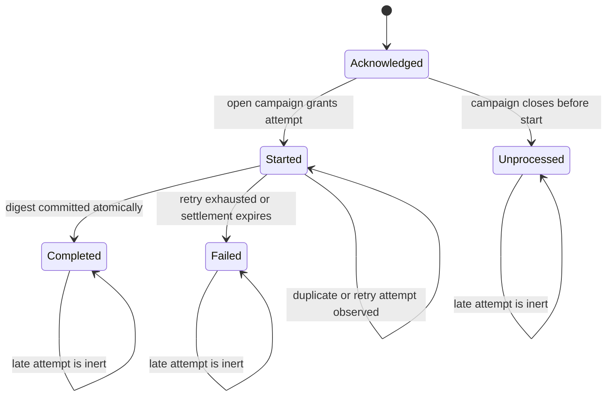
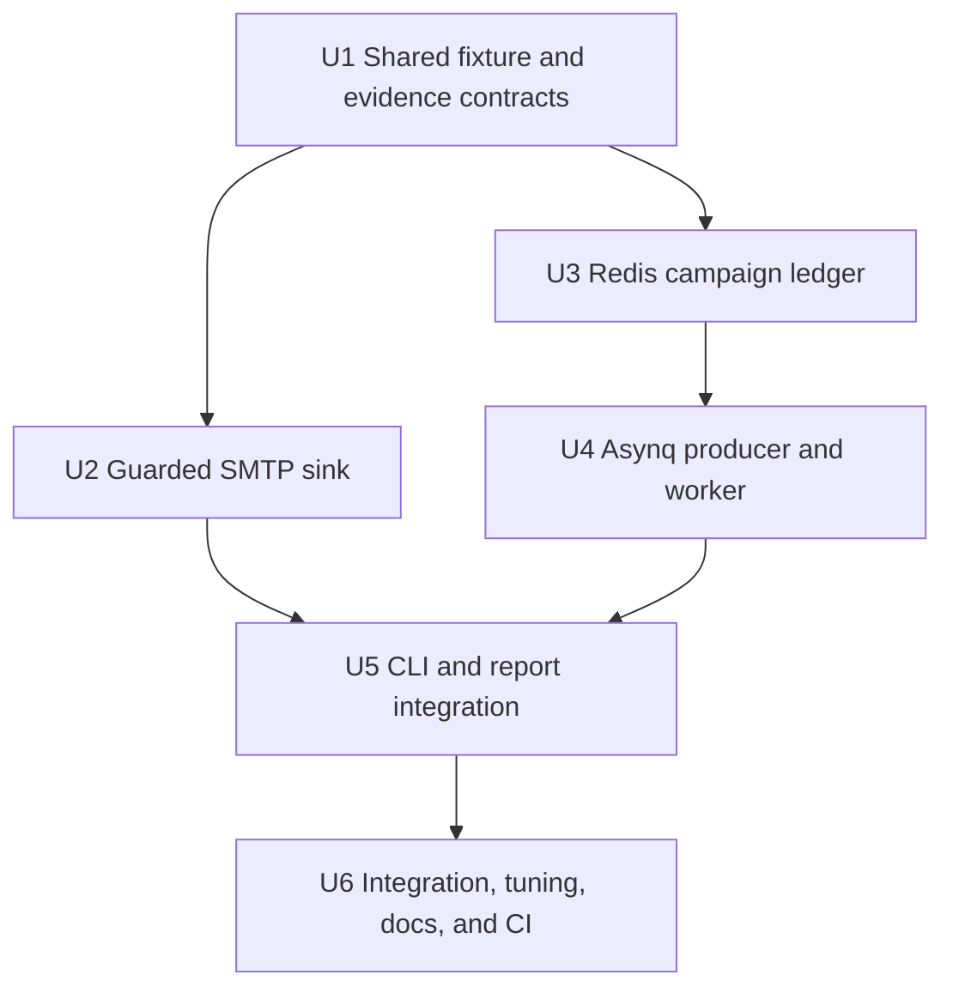

# feat: Add guarded delivery and distributed dry runs

## Summary

Extend the existing CLI with independently selectable guarded delivery and distributed execution while preserving the proven local dry run unchanged. Test-inbox runs use at most ten generated recipients; Asynq/Redis runs use separately started workers and durable application-owned state. Shared contracts remain small; network and Redis initialization occurs only after mode-specific preflight succeeds.

| Backend | Sink | Input | Result |
|---|---|---|---|
| `local` | `dry-run` | Supplied CSV | Existing authoritative path, unchanged defaults and report semantics |
| `local` | `test-inbox` | Generated fixture, 1-10 records | Guarded SMTP delivery with confirmed/rejected/indeterminate outcomes |
| `asynq` | `dry-run` | Generated fixture | Submit-and-wait distributed rendering with durable Redis accounting |
| `asynq` | `test-inbox` | Generated fixture, 1-10 records | At-least-once task execution with durable at-most-once SMTP reservation and terminal delivery evidence |

---

## Problem frame

The local pipeline already proves one million complete render-and-sink operations without infrastructure. The finalized requirements now call for optional production-oriented demonstrations, but they must not weaken local safety, privacy, accounting, reproducibility, or benchmark behavior. See the [origin requirements](../brainstorms/2026-07-26-personalized-email-campaign-requirements.md).

---

## Requirements

The origin remains authoritative. This plan implements its optional extension while preserving R1-R15.

- R16: allow only preflight-guarded test-inbox runs over deterministic generated fixtures of at most ten records; count completion only after confirmed SMTP acceptance and never retry an indeterminate delivery.
- R17: allow generated-fixture Asynq execution with either sink, separate worker processes, at-least-once task execution, application-owned idempotency, durable closure, bounded waiting, and honest Redis-loss semantics.
- R18: support all four independent backend/sink combinations, retain dependency-free runtime behavior for the default path, and use an atomic non-reclaimable delivery reservation to keep distributed SMTP submission at most once per intended synthetic message.

**Origin actors:** A1 Evaluator, A2 Operator, A3 Test delivery environment.

**Origin flows:** F1-F3 remain unchanged; F4 Guarded test-inbox demonstration and F5 Optional distributed execution become active.

**Origin acceptance examples:** AE1-AE16 remain regression constraints. AE17-AE21 define the new behavior and verification matrix.

---

## Scope boundaries

- No delivery to supplied recipients, arbitrary destinations, or more than ten test-inbox messages.
- No exactly-once task or delivery claim, detached submission, status API, dashboard, scheduler, or production campaign platform.
- No Redis Cluster support in this demonstration; Asynq v0.26.0 documents Lua-script limitations on Redis Cluster. Use standalone Redis.
- No persistence of supplied-recipient PII in Redis. Distributed tasks contain generated synthetic values, campaign identifiers, ordinals, and bounded metadata only.
- No hidden local fallback after optional-mode failure.
- No guessed production tuning. Candidate task sizes, concurrency, retry limits, completion deadlines, and shutdown settlement values are measured locally and reported as demonstration defaults only.
- No refactor of the local coordinator unless a failing regression test proves an optional integration cannot be isolated around its existing public seams.

### Deferred to follow-up work

- Provider-confirmed recovery of an SMTP acceptance lost to worker crash: unresolved reservations remain indeterminate unless a future provider-level reconciliation contract is added.
- Multiple weighted queues: add only after distinct measured workload classes establish a latency or fairness objective.
- Redis Cluster or another durable store: evaluate only if this demonstration becomes a deployed service.

---

## Context and research

### Relevant code and patterns

- `cmd/email-pipeline/main.go` owns command dispatch, static privacy-safe errors, signal handling, report output, and exit mapping. Split command implementations before adding optional branches so no source file crosses the repository's maintainability ceiling.
- `internal/campaign/runner.go` is the authoritative local lifecycle coordinator. `RunConfig.Sink` is the intended local adapter seam and already makes completion depend on full render plus sink acceptance.
- `internal/campaign/model.go` and `internal/campaign/report.go` own closed reasons, outcome derivation, reconciliation validation, and JSON evidence. Optional evidence must be additive and cannot make unknown distributed work pass normal reconciliation.
- `internal/recipientcsv/fixture.go` owns the deterministic PCG fixture algorithm. Optional modes must consume the same generated sequence without writing and rereading a temporary CSV.
- `internal/testprivacy/privacy_test.go` protects output surfaces and currently bans dial-capable packages from the whole binary. That structural assertion must become a behavioral default-path test because the same CLI now intentionally contains guarded network capabilities.
- `.github/workflows/ci.yml` already runs local formatting, vet, tests, race tests, and a no-service smoke benchmark. Keep that job service-free and add a separate Redis integration job.

### External references

- Pin `github.com/hibiken/asynq` at `v0.26.0`. Use `Client.EnqueueContext`, deterministic `TaskID`, explicit `MaxRetry`, `Retention`, `Server.Stop`, `Server.Shutdown`, and a single named queue. `Unique` may reduce duplicate enqueue but is not a correctness boundary.
- Asynq has no public wait primitive. Retained `TaskInfo` and Inspector state are diagnostic/observation aids; the application Redis ledger remains authoritative for campaign closure.
- Use `github.com/redis/go-redis/v9` at the version selected by Asynq (`v9.14.1`) for the ledger and atomic Lua transitions.
- Pin `github.com/wneessen/go-mail` at `v0.8.1`. It provides context-aware SMTP dialing, mandatory TLS defaults, authentication, typed delivery errors, and a custom dial function for tests. SMTP server acceptance after `DATA` is the confirmation boundary.
- Real Redis integration tests use a standalone `redis-server` configured through `REDIS_TEST_ADDR`; upstream Asynq test helpers are internal and unavailable to consumers.

---

## Key technical decisions

| Decision | Resolution and rationale |
|---|---|
| CLI shape | Keep one `email-pipeline` binary with `generate`, `run`, and `worker` commands. `run` gains `--backend` and `--sink`; command-level lazy initialization keeps default execution independent of services and credentials. |
| Generated optional input | Add a deterministic fixture iterator in `internal/recipientcsv` and make CSV generation use it. Optional modes accept `--count`, `--seed`, and `--algorithm`; they reject `--input` before initialization. |
| Preflight order | Parse and validate the complete mode combination, generated count, confirmation, destination allowlist, and required configuration before constructing SMTP, Redis, or Asynq clients. Refusal emits one static reason and zero work. |
| Test-inbox transport | Use SMTP through go-mail with mandatory TLS and bounded context. Destination, sender, server, and credentials come from environment variables. The independently configured allowlist must contain the normalized destination. |
| Delivery classification | Successful completion of the SMTP transaction is confirmed acceptance. Typed SMTP envelope/DATA rejection is definitive rejection. Connection or context loss after message submission begins is indeterminate. All other pre-submission failures are definitive transport failures. Neither rejection nor indeterminate delivery is retried automatically. |
| Local integration | Test-inbox supplies a sink function to the existing `campaign.Run`; no alternate local lifecycle engine is introduced. Generated records feed `campaign.SliceSource`-equivalent iteration directly. |
| Distributed source of truth | Asynq transports work; Redis campaign metadata and status sets are authoritative. Atomic Lua scripts implement open/closed checks, attempt registration, delivery reservation, terminal transition, duplicate-attempt counting, and closure. |
| Distributed work unit | A task carries a bounded ordinal range plus generation parameters and campaign ID, not recipient files or bodies. The worker deterministically regenerates each synthetic recipient in the range, checks durable campaign state before each render, computes the digest effect, and atomically commits each ordinal once. |
| Idempotency | Deterministic task IDs reduce enqueue ambiguity. Dry-run terminal transitions are compare-and-set. Test-inbox work atomically reserves each ordinal before SMTP and never reclaims the reservation for retry; duplicate handlers are inert, and unresolved reservations settle as indeterminate. Asynq uniqueness is optional throttling only. |
| Campaign ledger | Use one Redis hash tag per campaign so metadata and status keys share a slot. Maintain disjoint sets for acknowledged, started, completed, failed, and unprocessed ordinals plus counters for attempts, retries, duplicates, and timing aggregates. Store no recipient PII or rendered body. |
| Cancellation and closure | Producer cancellation atomically closes the campaign before reporting. Pending acknowledged ordinals become unprocessed; started ordinals may settle until the campaign deadline, then become failed due to interruption. Every later worker attempt reads closed state before rendering and exits inert. |
| Unknown state | Any loss of reliable enqueue acknowledgement or ledger visibility yields `failure` and `accounting_scope=unknown`. Preserve last-trustworthy counts; report known-enqueued, known-terminal, and unknown totals outside normal lifecycle buckets, with no reconciliation claim over unknown work. |
| Worker shutdown | `worker` handles SIGINT/SIGTERM by stopping fetch and invoking Asynq graceful shutdown with an explicit settlement timeout. Unfinished tasks return to Redis and remain safe to execute elsewhere. |
| Queue topology | One sink-specific queue per invocation (`email:dry-run` or `email:test-inbox`) prevents a worker without SMTP configuration from fetching delivery work. Do not expose queue weights or strict priority until workload classes exist. |
| Tuning | Implement candidate flags and benchmark harness first. Measure a small matrix, then set and document demonstration defaults in the same implementation cycle. Values remain environment-specific, not production recommendations. |
| Reporting | Extend the existing JSON document additively with selected mode, test-delivery evidence, and distributed evidence. Local default output remains semantically compatible; unknown distributed reports use a dedicated validation branch rather than weakening `Counts.Validate`. |
| Dependency isolation | The module gains optional libraries, but no service is contacted and no optional environment variable is read on the default path. Replace the obsolete import-graph ban with subprocess tests against unreachable endpoints and credential canaries. |

### Optional-mode configuration

| Surface | Configuration |
|---|---|
| Mode | `run --backend=local|asynq --sink=dry-run|test-inbox` with defaults `local` and `dry-run` |
| Generated input | `--count`, `--seed`, `--algorithm`; mutually exclusive with `--input` |
| Test confirmation | `--confirm-test-inbox=SEND_SYNTHETIC_TEST`; exact literal required |
| SMTP | `EMAIL_PIPELINE_SMTP_HOST`, `EMAIL_PIPELINE_SMTP_PORT`, `EMAIL_PIPELINE_SMTP_USERNAME`, `EMAIL_PIPELINE_SMTP_PASSWORD`, `EMAIL_PIPELINE_SMTP_FROM`, `EMAIL_PIPELINE_TEST_DESTINATION`, `EMAIL_PIPELINE_TEST_ALLOWLIST` |
| Redis | `EMAIL_PIPELINE_REDIS_ADDR`, optional `EMAIL_PIPELINE_REDIS_USERNAME`, `EMAIL_PIPELINE_REDIS_PASSWORD`, and `EMAIL_PIPELINE_REDIS_DB`; values never appear in output |
| Worker | `worker --concurrency`, `--shutdown-timeout`; Redis configuration remains environment-owned |
| Producer | `run --backend=asynq --task-size`, `--max-retry`, `--completion-deadline`; measured defaults are populated after U6 |

---

## Open questions

### Resolved during planning

- Test transport: authenticated SMTP with mandatory TLS through go-mail v0.8.1 is the smallest provider-neutral test-inbox demonstration.
- Optional dependency packaging: one binary with lazy command-level initialization preserves selector discoverability and runtime independence; a second binary would duplicate dispatch and reporting without removing module dependencies.
- Distributed durable evidence: Redis application keys and Lua transitions, not Asynq task state, own idempotency and terminal counts.
- Completion observation: producer polls the compact campaign ledger; retained Asynq task state is used for diagnosis and enqueue ambiguity checks only.
- Worker topology: explicit `worker` command in a separate process, one named queue, no in-process startup.
- Integration environment: real standalone Redis in a separate CI job and local manual QA; SMTP wire behavior is tested with a local fake server and one opt-in sandbox delivery.

### Deferred to implementation

- Exact measured defaults for task size, worker concurrency, retries, completion deadline, and shutdown timeout: U6 selects them from the required matrix after correctness gates pass.
- Exact go-mail typed-error mapping: inspect v0.8.1 error values while implementing U2 and conservatively classify any stage that cannot prove pre-acceptance failure as indeterminate.
- Lua script representation and Redis key names may be simplified if the same atomic state machine and privacy constraints are preserved.

---

## High-level technical design

This illustrates the intended approach and is directional guidance for review, not implementation specification.

Distributed lifecycle:

---

## Implementation units

### U1. Add generated-record and optional evidence contracts

**Goal:** Establish the minimum shared types needed by both optional modes without changing local default behavior.

**Requirements:** R2, R11-R18; F3-F5; AE9-AE21.

**Dependencies:** None.

**Files:**
- Modify: `internal/recipientcsv/fixture.go`
- Test: `internal/recipientcsv/fixture_test.go`
- Modify: `internal/campaign/model.go`
- Modify: `internal/campaign/runner_types.go`
- Modify: `internal/campaign/report.go`
- Test: `internal/campaign/model_test.go`
- Test: `internal/campaign/report_test.go`

**Approach:**
- Extract a deterministic generated-record iterator from the existing fixture algorithm; keep `Generate` as a streaming CSV adapter over that iterator so golden fixture bytes remain unchanged.
- Add closed failure reasons for guard refusal, confirmed delivery rejection, indeterminate delivery, distributed retry exhaustion, completion deadline, and unknown distributed state.
- Add explicit mode, test-delivery, and distributed-evidence value types. Unknown distributed evidence records known-enqueued, known-terminal, and unknown totals separately and cannot pass normal reconciliation validation.
- Keep existing local report fields and outcome derivation unchanged when optional evidence is absent.

**Execution note:** Add regression tests for fixture bytes and existing local report JSON before changing shared types.

**Patterns to follow:**
- Existing closed `Outcome`, `Reason`, and report projection types in `internal/campaign`.
- Existing deterministic fixture golden tests in `internal/recipientcsv`.

**Test scenarios:**
- Covers AE9. Same seed/count/algorithm produces the existing byte-identical fixture and the iterator yields the same ordered records and summary.
- Covers AE17. Count 10 is accepted by the generated source; count 11 remains representable but is rejected by later test-inbox preflight, never truncated.
- Covers AE19. Unknown distributed evidence serializes separate known-enqueued, known-terminal, and unknown totals and omits normal reconciliation/performance claims over unknown work.
- Regression: an existing local `RunReport` marshals with unchanged outcome, counts, performance meaning, and no optional sections.
- Error path: impossible optional evidence combinations fail report validation rather than producing misleading JSON.

**Verification:**
- Existing fixture and local campaign tests remain green, and shared types make unknown distributed state impossible to mislabel as reconciled full accounting.

### U2. Implement the guarded SMTP test-inbox sink

**Goal:** Provide a context-bounded SMTP adapter that emits only confirmed, rejected, or indeterminate delivery results and never owns campaign policy.

**Requirements:** R13, R16, R18; F4; AE11, AE16, AE17.

**Dependencies:** U1.

**Files:**
- Create: `internal/testinbox/config.go`
- Create: `internal/testinbox/smtp.go`
- Test: `internal/testinbox/config_test.go`
- Test: `internal/testinbox/smtp_test.go`

**Approach:**
- Parse SMTP environment values once at the CLI boundary into a typed configuration; normalize destination/allowlist identities conservatively and retain credentials only inside the adapter.
- Construct RFC-compliant messages from the already-rendered synthetic body, fixed sender, and one allowlisted destination using go-mail v0.8.1.
- Require TLS and bounded context. Disable library debug/auth logging.
- Map successful SMTP transaction completion to confirmed acceptance; typed SMTP rejection to rejected; post-submission connection/context uncertainty to indeterminate; known pre-submission setup/auth/dial failure to definitive failure.
- Expose the smallest function seam needed by `campaign.RunConfig.Sink`; errors crossing into campaign/report code are closed static reasons only.

**Execution note:** Implement against a local SMTP wire fake before connecting the adapter to the CLI.

**Patterns to follow:**
- `campaign.SinkFunc` context and static-reason boundary.
- Injected dial function supported by go-mail for deterministic protocol tests.

**Test scenarios:**
- Covers AE17. A local SMTP server returning acceptance after `DATA` yields confirmed acceptance exactly once.
- Covers AE17. Envelope or DATA rejection yields definitive rejection and no retry.
- Covers AE17. Connection loss after message submission begins yields indeterminate delivery and no retry.
- Error path: DNS/dial, TLS, authentication, and configuration failure occurs before acceptance and returns only a static category.
- Covers AE11. Destination absent from the independent allowlist is rejected by config before dialing.
- Covers AE16. Server responses, username, password, sender, destination, and rendered body cannot appear in adapter errors or captured output.

**Verification:**
- Protocol tests prove all three delivery outcomes without external network access, and the package exposes no retry loop.

### U3. Implement the atomic Redis campaign ledger

**Goal:** Make distributed recipient lifecycle, idempotency, closure, and trustworthy evidence durable and atomic independently of Asynq task state.

**Requirements:** R11-R13, R17-R18; F5; AE18-AE20.

**Dependencies:** U1.

**Files:**
- Create: `internal/distributed/model.go`
- Create: `internal/distributed/ledger.go`
- Create: `internal/distributed/scripts.go`
- Test: `internal/distributed/model_test.go`
- Test: `internal/distributed/ledger_integration_test.go`

**Approach:**
- Create campaign metadata with generated fixture parameters, total eligible count, open state, deadlines, and version. Use a random non-sensitive campaign ID and Redis hash-tagged keys.
- Track acknowledged, started, delivery-reserved, completed, failed, and unprocessed ordinals in disjoint lifecycle state, plus bounded counters/timing aggregates in metadata. No email, name, body, credential, or raw external error enters Redis.
- Implement atomic scripts for acknowledge range, begin attempt, reserve delivery, commit completion/failure, close campaign, settle expired started or reserved work, and read a consistent snapshot.
- `begin attempt` checks open state and terminal sets before returning permission to render; retries/duplicates increment observability counters but cannot create another terminal transition.
- Closure atomically changes state before pending work is classified. Snapshot validation proves set disjointness and count equations when state is trustworthy.
- Redis errors retain the caller's last confirmed snapshot and become unknown state; no read failure is interpreted as an empty set or missing campaign.

**Execution note:** Develop each Lua transition test-first against real standalone Redis; do not use an in-memory fake as proof of atomicity.

**Patterns to follow:**
- Closed domain values and invariant validation from `internal/campaign/model.go`.
- Context on every go-redis operation and static wrapped errors at the package boundary.

**Test scenarios:**
- Covers AE18. Repeated acknowledge/start/complete calls for one ordinal commit one completion while attempts and duplicates remain observable.
- Covers AE18. A retry after a started attempt can complete once; retry exhaustion commits one failed terminal state.
- Covers AE20. Closure before start moves acknowledged work to unprocessed and every later begin attempt is inert before rendering.
- Covers AE20. Closure with started work permits settlement until deadline, then commits remaining started ordinals as interrupted failures once.
- Covers AE18. A delivery reservation is granted once across concurrent attempts, is never reclaimed, and an unresolved reservation settles as indeterminate without another SMTP attempt.
- Covers AE19. Redis loss preserves the last trustworthy snapshot and returns unknown; it never fabricates zero work or terminal buckets.
- Privacy: Redis key/value scan contains no generated email/name/body or credential canaries, only campaign IDs, fixture parameters, ordinals, states, and metrics.
- Concurrency: many goroutines race duplicate transitions under `-race`; Redis sets remain disjoint and counts stable.

**Verification:**
- Real Redis tests demonstrate atomic idempotency, durable closure, and valid snapshots under duplicate and concurrent execution.

### U4. Implement Asynq producer coordination and worker execution

**Goal:** Submit generated bounded work, execute it in separate workers, wait for durable terminal state, and report retry/duplicate/shutdown evidence honestly.

**Requirements:** R2, R7-R9, R11-R18; F5; AE12, AE16, AE18-AE21.

**Dependencies:** U3.

**Files:**
- Create: `internal/distributed/task.go`
- Create: `internal/distributed/producer.go`
- Create: `internal/distributed/worker.go`
- Test: `internal/distributed/task_test.go`
- Test: `internal/distributed/asynq_integration_test.go`

**Approach:**
- Pin Asynq v0.26.0 and use sink-specific `email:dry-run` and `email:test-inbox` queues. Task payload contains campaign ID, selected sink, fixture algorithm/seed/count, and bounded ordinal range only.
- Producer creates the ledger, enqueues ranges sequentially with deterministic task IDs, explicit retry/retention settings, and bounded enqueue contexts, recording acknowledged ranges only after confirmed enqueue.
- On enqueue error, inspect deterministic ID when possible. If commitment cannot be proven, close as unknown and stop enqueueing; never resubmit blindly or fall back locally.
- Worker decodes/validates payload, begins each ordinal through the ledger, regenerates the synthetic recipient, and renders through the selected sink. Dry-run work commits digest metadata; test-inbox work obtains one durable delivery reservation before SMTP and commits only the closed confirmed/rejected/indeterminate result without storing body or destination.
- Permanent payload/configuration errors wrap `asynq.SkipRetry`; transient Redis/worker errors retry through explicit policy. ErrorHandler records exhaustion through the ledger without raw error strings.
- Producer polls compact ledger snapshots until terminal, cancellation, unknown state, or completion deadline. Cancellation closes durably before settlement and reporting.
- Worker command uses `Server.Stop` and `Server.Shutdown`; explicit shutdown timeout returns unfinished tasks for another worker.

**Execution note:** Start with one-task real Redis integration, then add duplicate/retry/crash/shutdown scenarios before performance tuning.

**Patterns to follow:**
- Existing `campaign.Render` and `DigestSink` for actual useful work.
- Asynq deterministic `TaskID`, `MaxRetry`, `Retention`, retry context metadata, `SkipRetry`, and graceful server lifecycle.

**Test scenarios:**
- Covers AE18. Duplicate deterministic task enqueue and repeated execution yield one terminal effect/count and observable duplicate attempts.
- Covers AE18. Handler commits effect then returns a transient failure; redelivery remains idempotent.
- Covers AE18. Retry exhaustion archives a dry-run task and commits one failed ordinal without double counting.
- Covers AE18. Test-inbox duplicate execution, redelivery, uniqueness expiry, and a crash after reservation never produce a second SMTP attempt; unresolved reservations settle as indeterminate.
- Covers AE19. Redis unavailable before acknowledged enqueue reports zero distributed campaign work; failure after an acknowledged prefix preserves prefix evidence.
- Covers AE19. Connection loss around enqueue or ledger polling yields unknown state, not proven failure/completion or local fallback.
- Covers AE20. No worker progress reaches the completion deadline and reports failure; operator cancellation reports interrupted only after durable closure and trustworthy classification.
- Covers AE20. Graceful shutdown stops fetching, requeues unfinished work, and a second worker reaches the same idempotent terminal result.
- Privacy: task payloads, retained results, archived errors, and Redis state contain no supplied PII, rendered body, Redis secret, or SMTP secret.

**Verification:**
- Separate producer and worker processes complete a generated fixture through real Redis with balanced durable counts; outage, retry, duplicate, and shutdown tests remain honest and race-clean.

### U5. Integrate selectors, commands, reports, and privacy boundaries

**Goal:** Expose all four backend/sink combinations through a discoverable CLI while preserving the exact default local behavior and refusal-first safety.

**Requirements:** R1-R18; F1-F5; AE1-AE20.

**Dependencies:** U2, U4.

**Files:**
- Modify: `cmd/email-pipeline/main.go`
- Create: `cmd/email-pipeline/generate_command.go`
- Create: `cmd/email-pipeline/run_command.go`
- Create: `cmd/email-pipeline/worker_command.go`
- Create: `cmd/email-pipeline/config.go`
- Test: `cmd/email-pipeline/main_test.go`
- Create: `cmd/email-pipeline/optional_test.go`
- Modify: `internal/testprivacy/privacy_test.go`
- Modify: `go.mod`
- Modify: `go.sum`

**Approach:**
- Keep `main.go` limited to panic boundary, dispatch, usage, and exit mapping; move command implementations by responsibility.
- Parse all run flags into a typed mode configuration and validate the full combination before opening input or constructing optional clients.
- Route default `local + dry-run + --input` through the existing reader and `campaign.Run` without optional environment access.
- Route `local + test-inbox` through generated iteration and the SMTP sink after confirmation, count, allowlist, and configuration preflight.
- Route both Asynq sinks through generated parameters and the producer; reject `--input`. Test-inbox preflight completes before Redis construction or enqueue. Route `worker` to the sink-specific separate Asynq server lifecycle.
- Extend output with mode-specific evidence while preserving existing outcomes and exit codes. Guard refusal emits failure, zero work, and a static reason.
- Replace dependency-graph network prohibition with subprocess tests that set unreachable optional endpoints and credential canaries, then prove default generate/run complete unchanged without attempting network or revealing optional environment values.

**Execution note:** Lock the CLI behavior with refusal tests before wiring live adapters.

**Patterns to follow:**
- Existing `flag.FlagSet`, signal context, I/O-injected command tests, static errors, report marshal, and outcome exit mapping.

**Test scenarios:**
- Covers AE1-AE16. Existing generate, local run, cancellation, privacy, and million-record smoke behavior remains unchanged with selectors omitted.
- Covers AE17. Valid test-inbox config sends generated records only with either backend; counts 0 or above 10, supplied `--input`, missing confirmation, and missing allowlist fail before adapter or Redis construction with zero attempts.
- Covers AE12/AE19. Asynq selection with unreachable Redis fails visibly and never invokes local processing; default local run succeeds under the same environment.
- Covers AE18. Asynq producer requires generated parameters and does not start a worker in process.
- Covers AE20. Worker command exits through graceful shutdown and emits no credential-bearing errors.
- Covers AE16. Optional configuration, task/SMTP errors, panic values, generated recipient values, and supplied recipient canaries are absent from stdout/stderr and persisted test artifacts.
- CLI matrix: all four backend/sink combinations, mutually exclusive input forms, invalid enum values, and optional flags in the wrong mode have deterministic outcomes.

**Verification:**
- The binary exposes the documented commands and all four supported combinations; omitted selectors remain the existing offline path byte-for-byte at the behavioral contract level.

### U6. Select measured defaults and document repeatable operation

**Goal:** Complete real-service verification, select demonstration settings from evidence, and make local and optional workflows reproducible without turning optional services into default prerequisites.

**Requirements:** R8, R13, R15-R18; F3-F5; AE9-AE12, AE16-AE21.

**Dependencies:** U5.

**Files:**
- Modify: `README.md`
- Modify: `.github/workflows/ci.yml`
- Modify: `.gitignore`
- Create: `internal/distributed/benchmark_test.go`
- Test: `internal/testprivacy/privacy_test.go`

**Approach:**
- Benchmark a bounded matrix of task sizes, worker concurrency, retry limits, completion deadlines, and shutdown timeouts against standalone Redis after correctness/race/privacy gates pass. Record every candidate and choose useful-work throughput only among candidates with exact accounting, bounded memory/queue growth, duplicate/retry recovery, and no observed starvation.
- Set selected values as demonstration defaults in CLI configuration and state environment/hardware; do not call them production optimal.
- Preserve the existing million-record local benchmark and reference evidence as authoritative.
- Document all four combinations, synthetic-only guards, environment variables by purpose, least privilege, sink-specific worker startup, Redis failure semantics, at-most-once SMTP reservation without exactly-once claims, and opt-in sandbox SMTP verification.
- Keep the existing no-service CI job. Add a separate Redis service job for distributed integration tests; SMTP tests remain local wire tests and require no credentials.
- Ignore optional benchmark output and local service captures; never commit credentials or delivery artifacts.

**Execution note:** Capture tuning evidence only after all functional and race tests pass. Do not select a value from throughput alone.

**Patterns to follow:**
- Existing README benchmark disclosure and separate generation/processing measurements.
- Existing minimal GitHub Actions workflow; no deployment or publishing jobs.

**Test scenarios:**
- Covers AE21. Every candidate is reported; the selected default satisfies accounting, bounded resource, retry/duplicate recovery, and no-starvation gates.
- Covers AE10/AE12. The one-million local workflow and service-free CI job remain unchanged and pass with Redis/network unavailable.
- Covers AE18-AE20. Redis CI exercises duplicate, retry exhaustion, no-worker deadline, closure, and graceful shutdown scenarios.
- Covers AE17. SMTP protocol tests run without credentials; a documented opt-in sandbox run sends no more than ten generated messages.
- Covers AE16. Repository scan and subprocess canaries find no credential, recipient PII, raw body, Redis URL, or SMTP response leakage.

**Verification:**
- Fresh evaluators can reproduce the local benchmark without services and independently run either optional demonstration using explicit setup, while all selected operational values have recorded evidence.

---

## Parallel execution strategy

1. U1 is serialized because it owns shared fixture/report contracts.
2. After U1, U2 and U3 run in parallel with disjoint package ownership.
3. U4 follows U3 and owns only `internal/distributed` files not owned by U3.
4. U5 is the sole integration owner for `cmd/email-pipeline`, `go.mod`, `go.sum`, and cross-package privacy tests.
5. U6 follows integrated behavior and owns docs, CI, benchmark selection, and final verification.

Agents must not stage or commit shared-directory changes. The orchestrator reviews each batch, checks actual file collisions, and commits only complete logical units after tests pass.

---

## System-wide impact

- **Interaction graph:** CLI preflight chooses either the unchanged local runner, local runner with SMTP sink, distributed producer, or explicit worker. Redis ledger joins producer and worker; reporting consumes immutable local or distributed evidence.
- **Error propagation:** External errors are converted at adapter boundaries into closed static reasons. SMTP ambiguity remains distinct from rejection. Redis uncertainty overrides normal outcome/reconciliation claims as failure.
- **State lifecycle risks:** The major risks are enqueue ambiguity, worker crash after effect computation, duplicate attempts, campaign closure races, and Redis loss. Deterministic task IDs plus atomic application state address duplicates; unknown-state reporting prevents false certainty.
- **API surface parity:** The CLI remains the only public interface. Internal packages can evolve without compatibility shims.
- **Integration coverage:** Unit mocks are insufficient for SMTP protocol stages, Redis atomicity, Asynq retry/redelivery, and process shutdown; each has a real boundary test.
- **Unchanged invariants:** Local supplied-file processing, cancellation semantics, privacy, fixture bytes, report meanings, exit codes, and million-record benchmark remain regression-protected.

---

## Risks and dependencies

| Risk | Likelihood | Impact | Mitigation |
|---|---|---|---|
| SMTP error cannot prove whether server accepted a message | Medium | High | Treat every post-submission uncertainty as indeterminate and never retry automatically. |
| Redis ledger and Asynq state diverge | Medium | High | Ledger is authoritative; Asynq state is diagnostic. Atomic transitions and deterministic task IDs make replay safe. |
| Redis disappears during enqueue or closure | Medium | High | Stop work, preserve last trustworthy snapshot, report unknown remainder, and never claim reconciliation. |
| Late retry renders after terminal report | Medium | High | Durable closed-state check occurs before every ordinal render; terminal transitions are inert. |
| Optional dependencies regress local portability | Low | High | Lazy initialization, service-free default CI, unreachable-endpoint subprocess tests, and unchanged local smoke benchmark. |
| Shared report changes weaken invariants | Medium | High | Separate validation branches for full/prefix and distributed unknown; existing local report tests stay authoritative. |
| Operational settings are chosen prematurely | Medium | Medium | U6 matrix is a shipping gate; defaults are not finalized before measured correctness/resource evidence. |
| Source files become oversized during CLI integration | High | Medium | Split commands before adding branches and keep new packages responsibility-specific. |

Technical prerequisites for optional QA are Go 1.26.5, standalone Redis 7.x, and an opt-in SMTP sandbox. Neither service is required for default build, test, run, or benchmark workflows.

---

## Success metrics

- All existing local tests and the documented one-million workflow pass unchanged without Redis, network access, or optional credentials.
- AE17 proves refusal-first guards, a hard ten-message bound, confirmed/rejected/indeterminate delivery, and zero automatic retries.
- AE18 proves one durable completion/failure per ordinal under duplicate task execution, retry, uniqueness expiry, and worker recovery.
- AE19 proves prefix/unknown reporting without false terminal classification or local fallback during Redis ambiguity.
- AE20 proves durable closure, inert late attempts, no-worker deadline failure, and graceful worker handoff.
- AE21 publishes the tested tuning matrix and selected demonstration defaults with all correctness/resource gates.
- Privacy canaries remain absent from CLI output, task payloads, Redis state, SMTP diagnostics, retained results, tests, and benchmark artifacts.

---

## Documentation and operational notes

- README remains the evaluator runbook. Keep local instructions first and label optional sections clearly.
- Never print environment values, destination addresses, Redis addresses, SMTP responses, task payloads, or raw external errors.
- The test-inbox destination is independently configured and must also appear in the allowlist; campaign/generated recipient addresses are never used as transport destinations.
- Redis keys should have an explicit retention/cleanup policy after terminal reporting so repeated demonstrations do not accumulate indefinitely; cleanup must never run before the report snapshot is secured.
- The worker command is an operational process. Its normal logs, if any, use static messages and non-sensitive campaign/task identifiers only.

---

## Sources and references

- **Origin document:** [docs/brainstorms/2026-07-26-personalized-email-campaign-requirements.md](../brainstorms/2026-07-26-personalized-email-campaign-requirements.md)
- Existing local plan: [docs/plans/2026-07-27-002-feat-million-recipient-dry-run-plan.md](2026-07-27-002-feat-million-recipient-dry-run-plan.md)
- Related code: `cmd/email-pipeline/main.go`, `internal/campaign/runner.go`, `internal/campaign/render.go`, `internal/campaign/report.go`, `internal/recipientcsv/fixture.go`
- Asynq v0.26.0 package/source: `https://pkg.go.dev/github.com/hibiken/asynq@v0.26.0`
- Asynq task retention/results: `https://github.com/hibiken/asynq/wiki/Task-Retention-and-Result`
- Asynq unique tasks: `https://github.com/hibiken/asynq/wiki/Unique-Tasks`
- go-mail v0.8.1 package/source: `https://pkg.go.dev/github.com/wneessen/go-mail@v0.8.1`
- Redis Go client: `https://pkg.go.dev/github.com/redis/go-redis/v9`
