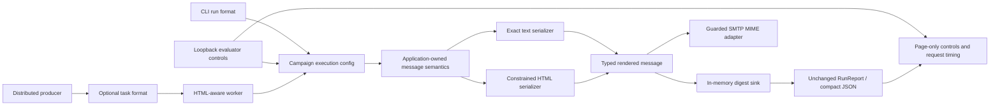

# feat: Add evaluator benchmark page

## Summary

Extend the existing campaign pipeline with one typed, application-owned plain-text/HTML rendering contract, then carry that contract through local CLI, guarded SMTP, and distributed execution without changing established text, report, accounting, or ledger contracts. Build the evaluator page directly on the service-free local campaign path, with four bounded controls, a fixed preview, distinct timing scopes, one-run admission, cancellation, progressive HTMX enhancement, and exact plain-text report compatibility.

The current uncommitted `cmd/email-pipeline/web.go`, `cmd/email-pipeline/web_test.go`, and `cmd/email-pipeline/web/` files are preliminary scaffolding. The approved requirements, not that preliminary behavior, govern implementation.

---

## Problem Frame

The CLI already provides authoritative, reproducible one-million-record evidence, but it is not an immediately inspectable browser demonstration. The new page must expose the same local rendering, digest acceptance, accounting, privacy, and cancellation semantics without becoming a campaign-authoring surface or initializing optional infrastructure (see origin: `docs/brainstorms/2026-07-28-evaluator-benchmark-page-requirements.md`).

---

## Requirements

- R1-R6. Accept exactly count, fixture seed, worker count, and text/HTML format; enforce the approved bounds and first-load defaults.
- R7-R12. Render and digest the selected representation for every eligible recipient; preserve exact text bytes; keep HTML semantically equivalent and inactive; show the fixed `Customer 000001` preview.
- R13-R17. Keep campaign processing time and total server-request duration distinct; preserve accounting and exact explicit plain-text report bytes; identify browser evidence as machine-specific and subordinate to the CLI benchmark.
- R18-R24. Support complete non-JavaScript pages and enhanced fragments, field-specific validation, immediate one-run refusal, owned cancellation, disconnect cancellation, readable terminal states, and the specified HTTP statuses.
- R25-R27. Show the required safety statement verbatim, expose no recipient/content/infrastructure controls, and keep every browser action isolated from SMTP, Redis, Asynq, the distributed ledger, and non-listener network access.

**Origin actor:** A1 (Evaluator)

**Origin flows:** F1 (Inspect and run a demonstration), F2 (Cancel an active demonstration)

**Origin acceptance examples:** AE1-AE10

---

## Scope Boundaries

- No recipient input, upload, arbitrary message content, arbitrary subject, arbitrary HTML, or campaign authoring.
- No browser access to SMTP, test-inbox delivery, Redis, Asynq, distributed-ledger execution, backend selection, queues, or optional-service fallback.
- No external browser assets, analytics, fonts, images, or network calls beyond the literal-loopback HTTP listener.
- No parallel or queued browser runs, cancel-and-replace behavior, detached work, persisted history, polling dashboard, or new benchmark claim.
- No change to existing plain-text message bytes, compact report JSON bytes, report trailing newline, outcomes, accounting categories, reconciliation identities, privacy policy, or cancellation settlement.
- No change to Asynq task types or queue names, deterministic task IDs, Redis keys, ledger schema or snapshots, Lua scripts, or ledger authority.
- No multipart email design, arbitrary template system, or format-specific promotion content.

### Deferred to Follow-Up Work

- Durable `docs/solutions/` learning capture: consider after implementation and verification; the repository currently has no institutional-learning store.

---

## Context & Research

### Relevant Code and Patterns

- `internal/campaign/render.go`: current exact plain-text construction and non-retaining digest-sink boundary.
- `internal/campaign/worker.go`: rendering and sink acceptance occur before completion is recorded.
- `internal/campaign/runner.go`: local coordination, worker configuration, cancellation settlement, and accounting.
- `internal/campaign/runner_types.go`: run configuration and `RunReport`; format belongs in execution configuration, not serialized report evidence.
- `internal/campaign/report.go`: compact JSON serialization and reconciliation validation; this contract remains unchanged.
- `cmd/email-pipeline/run_command.go`: external flag validation, local/distributed routing, optional-service construction, and report newline behavior.
- `internal/distributed/task.go`: strict task JSON decoder, payload validation, task types, and deterministic task IDs.
- `internal/distributed/producer.go`: bounded synthetic range payload creation and enqueue sequence.
- `internal/distributed/worker.go`: task decoding, deterministic recipient regeneration, ledger matching, rendering, and completion.
- `internal/distributed/campaign.go`: campaign snapshot contract; format must not extend its identity/accounting fields.
- `internal/testinbox/smtp.go`: refusal-first SMTP adapter and current fixed plain-text MIME selection.
- `cmd/email-pipeline/web.go`: preliminary loopback server, strict form parsing, local generated-source execution, content negotiation, and one-slot admission.
- `cmd/email-pipeline/web/page.html` and `cmd/email-pipeline/web/result.html`: preliminary server-rendered full-page and fragment surfaces to bring up to the approved requirements.
- `cmd/email-pipeline/web_test.go`: current handler, loopback, shutdown, representation, asset, and optional-service isolation coverage.
- `README.md`: authoritative benchmark, safety, architecture, and evaluator documentation.

### Institutional Learnings

- `docs/plans/2026-07-27-002-feat-million-recipient-dry-run-plan.md`: preserve both accounting identities and privacy-safe evidence across every new representation.
- `docs/plans/2026-07-27-003-feat-optional-delivery-distributed-plan.md`: evolve payloads with deterministic regeneration inputs rather than PII or rendered bodies; keep ledger state authoritative; preserve refusal-first SMTP and indeterminate-delivery handling.
- `docs/ai-development-workflow.md`: lock established contracts before adapters change, then verify race, privacy, poisoned-configuration, and real integration boundaries; manual verification remains necessary for cancellation timing and browser behavior.
- No `docs/solutions/` directory or dedicated critical-pattern document exists.

### External References

- No additional external research is required. The selected libraries and HTTP/HTMX patterns are already established locally, and the approved behavior is repository-specific. The embedded HTMX 2.0.4 asset and license remain pinned local artifacts.

---

## Key Technical Decisions

- **Closed format domain:** Define one campaign-level text/HTML format type. Its zero/default behavior is text; unsupported external values fail validation.
- **Shared semantic rendering:** Subject, greeting selection, normalized personalization, fallback wording, and promotion content originate from one application-owned semantic path. Representation serializers may change presentation only.
- **Typed rendered delivery:** Carry trusted format with rendered bytes through digest and SMTP boundaries. Do not infer MIME from message content or parse rendered bytes to recover metadata.
- **Exact text compatibility:** Characterize named and fallback messages as byte fixtures before refactoring. Text output, including blank lines and final newline, remains identical.
- **Unchanged report contract:** Do not add format or request duration to `campaign.RunReport` or `campaign.MarshalReport`. The web view model owns submitted/effective controls and display metadata.
- **Per-message MIME:** SMTP chooses `text/plain` or `text/html` from each typed message while preserving all existing configuration guards, destination policy, TLS requirements, acceptance boundary, and error classification.
- **Additive distributed payload:** Add an optional validated format field to `TaskPayload`; missing means text and default text is omitted when compatibility requires. Keep the current payload version unless implementation discovers an external versioning requirement not represented in current source.
- **Worker-first rollout:** Old workers reject unknown fields because decoding disallows them. Deploy HTML-aware workers before any producer can emit HTML payloads; retain those workers until all HTML tasks are terminal.
- **Ledger remains format-agnostic:** Workers trust the validated task format while snapshot matching continues to compare only established campaign identity and accounting fields. No format migration enters Redis.
- **Direct local web execution:** The page constructs only a deterministic generated source and local `campaign.Run` configuration. It never calls CLI run routing, distributed producers/workers, SMTP constructors, Redis constructors, or ledger code.
- **Validation before admission:** Parse and validate all four fields before acquiring the single-run slot. Invalid requests start no campaign; valid contention returns immediately without queueing or cancelling active work.
- **Owned enhanced cancellation:** Associate an accepted enhanced run with an opaque run identity and cancel function. A missing, stale, or non-applicable identity returns conflict and cannot affect a different run.
- **Disconnect-bound fallback:** Non-enhanced work stays attached to the request context, so navigation or disconnection stops unseen work under existing campaign settlement semantics.
- **Separate timing domains:** Keep existing campaign processing elapsed time untouched. Measure total server-request duration only after successful validation and until response data is ready, excluding browser rendering and network transfer.
- **Exact text representation:** For explicit `Accept: text/plain`, emit unmodified compact report JSON plus exactly one newline. Put selected format and total duration in response metadata, not the body.
- **Fixed safe preview:** Render `Customer 000001` independently of controls and runs. Text shows exact bytes; HTML uses the same generated bytes for a constrained sandboxed view and escaped source.
- **Progressive enhancement:** Full-page POST is authoritative. HTMX replaces a stable region and must display safe 400, 409, and 429 fragments without converting them to success statuses.

---

## Open Questions

### Resolved During Planning

- **Should format be serialized in `campaign.RunReport`?** No. It is execution/view metadata, and R16 requires the compact report body to remain exact.
- **Should format enter the distributed campaign snapshot or ledger comparison?** No. The task carries validated rendering intent; existing snapshot fields remain the durable campaign/accounting contract.
- **How are old distributed payloads handled?** Missing format decodes as text. Default text payloads omit the optional field; HTML is explicit.
- **What rollout order is safe?** HTML-aware workers first, then HTML-producing producers. Producer-first rollout would make old strict workers reject tasks.
- **Can the page reuse optional CLI execution routing?** No. Direct local campaign construction is required to make the no-SMTP/no-Redis/no-Asynq/no-ledger boundary structural.

### Deferred to Implementation

- Exact helper/type names and template decomposition: choose while implementing against current package conventions; they do not change approved behavior.
- Exact response-header names for selected format and total duration: choose a stable, documented representation while preserving the body; prefer standard `Server-Timing` for duration if it accurately expresses the required scope.
- Whether existing tests need small controllable runner/sink seams for deterministic cancellation and admission timing: introduce only the minimum seam needed to test the approved lifecycle.

---

## High-Level Technical Design

> *This illustrates the intended approach and is directional guidance for review, not implementation specification. The implementing agent should treat it as context, not code to reproduce.*



Dependency order:

```text
U1 shared rendering contract
  -> U2 local CLI and SMTP propagation
       -> U3 backward-compatible distributed consumers
            -> U4 HTML-producing distributed producers
       -> U5 HTTP lifecycle and execution controller
            -> U6 full-page/HTMX UI and preview states
U4 + U6 -> U7 documentation and complete evidence
```

---

## Implementation Units

### U1. Establish the shared typed renderer

**Goal:** Introduce one application-owned text/HTML rendering contract while freezing plain-text bytes and existing personalization/completion semantics.

**Requirements:** R7-R12, R15; F1; AE1-AE3

**Dependencies:** None

**Files:**
- Modify: `internal/campaign/render.go`
- Modify: `internal/campaign/worker.go`
- Test: `internal/campaign/render_test.go`
- Test: `internal/campaign/runner_test.go`

**Approach:**
- Define the closed text/HTML domain and a rendered-message value carrying trusted format plus complete bytes.
- Separate semantic message construction from representation serialization so both branches share subject, greeting, fallback, and promotion decisions.
- Preserve the exact current text serializer, including blank lines and trailing newline.
- Escape personalized text in HTML contexts and keep the representation free of active/remote content.
- Pass the selected complete representation to the sink before recording completion; keep the digest sink non-retaining.
- Expose the same renderer for fixed preview generation so page templates do not duplicate message content.

**Execution note:** Add exact byte-characterization tests before changing the rendering boundary.

**Patterns to follow:**
- `internal/campaign/render.go` for the existing sink-after-full-render completion boundary.
- `internal/campaign/runner.go` for unchanged accounting and cancellation projection.

**Test scenarios:**
- Covers AE1. Render the fixed named recipient as text and assert exact established bytes, including subject, spacing, greeting, promotion, and final newline.
- Covers AE2. Render named and empty-name recipients as text and assert byte compatibility plus unchanged named/fallback categories.
- Covers AE3. Render the same recipients as HTML and assert subject, greeting branch, personalization, and promotion semantic parity.
- Covers AE3. Assert HTML has no scripts, forms, event attributes, remote assets, or active external links and escapes markup-like name content.
- Integration: Run an HTML campaign through a recording digest seam and prove every eligible complete HTML representation is accepted before completion increments.
- Error path: Refuse sink acceptance in each format and preserve the existing failure reason and reconciliation counts.
- Regression: Text runs retain existing report values, privacy-safe samples, cancellation behavior, and digest accounting.

**Verification:**
- Existing text fixtures remain byte-identical.
- Format changes representation only; report/accounting semantics do not branch.

---

### U2. Propagate format through local execution and SMTP

**Goal:** Carry selected format through synchronous CLI execution and select SMTP MIME per delivery while keeping omitted/default behavior exactly text.

**Requirements:** R7-R9, R15-R16; F1; AE2, AE3, AE9

**Dependencies:** U1

**Files:**
- Modify: `internal/campaign/runner_types.go`
- Modify: `internal/campaign/runner.go`
- Modify: `cmd/email-pipeline/run_command.go`
- Modify: `cmd/email-pipeline/main.go`
- Modify: `internal/testinbox/smtp.go`
- Test: `internal/campaign/runner_test.go`
- Test: `cmd/email-pipeline/main_test.go`
- Test: `internal/testinbox/smtp_test.go`
- Test: `internal/campaign/report_test.go`

**Approach:**
- Add format to execution configuration, resolving omission to text.
- Add a bounded CLI selector and propagate it through local file and generated-fixture runs without creating message-authoring controls.
- Reject unsupported values during configuration preflight, before opening input or constructing optional services.
- Change SMTP delivery input to retain trusted format and select MIME separately for each message.
- Preserve envelope/destination controls, fixed guarded test-inbox behavior, TLS, volume/confirmation policy, and delivery outcome classification.
- Do not add format to serialized report JSON, exit-code derivation, or accounting.

**Execution note:** Lock omitted-selector CLI output and current SMTP text behavior before adding HTML cases.

**Patterns to follow:**
- `cmd/email-pipeline/run_command.go` for refusal-first option validation and optional-service initialization order.
- `internal/testinbox/smtp.go` and `internal/testinbox/smtp_test.go` for conservative SMTP stage classification.

**Test scenarios:**
- Default local file and generated runs without a format selector produce the established text bytes, compact report, newline, and exit code.
- Explicit text behaves identically to omitted format.
- HTML local dry-run renders and digests every eligible recipient as HTML while retaining counts and sample categories.
- Invalid format performs no input read, sink acceptance, or optional-service construction and returns the existing safe configuration failure shape.
- SMTP sends text messages as `text/plain` and HTML messages as `text/html`, based on each delivery rather than mutable sink-global state.
- SMTP acceptance, rejection, transport failure, and indeterminate classification remain unchanged for both MIME choices.
- Covers AE9. Report serialization does not gain format or page-duration fields and retains exact compact bytes.
- Cancellation in both formats retains existing admission closure, settlement, and reconciliation behavior.

**Verification:**
- Omitted format remains the existing authoritative CLI path.
- SMTP MIME follows trusted per-message format without weakening safety guards.

---

### U3. Make distributed consumers backward-compatible and HTML-aware

**Goal:** Prepare task decoding and workers to process old missing-format text tasks and new explicit HTML tasks before any producer emits HTML.

**Requirements:** R7-R9, R15; compatibility prerequisite for F1 and AE3

**Dependencies:** U2

**Files:**
- Modify: `internal/distributed/task.go`
- Modify: `internal/distributed/worker.go`
- Modify: `cmd/email-pipeline/worker_command.go`
- Test: `internal/distributed/task_test.go`
- Test: `internal/distributed/worker_test.go`
- Test: `internal/distributed/asynq_integration_test.go`
- Test: `internal/distributed/ledger_integration_test.go`
- Test: `cmd/email-pipeline/main_test.go`

**Approach:**
- Add the optional format field to the bounded synthetic `TaskPayload`; decode absence as text before validation and reject unsupported values.
- Omit default text during encoding where needed to preserve established payload shape; encode HTML explicitly.
- Keep payload version, task types, sink queues, task IDs, campaign IDs, range semantics, and privacy restrictions unchanged.
- Render the decoded format through the shared campaign renderer.
- Carry the typed rendered message through the distributed delivery interface and command-layer worker adapter so test-inbox workers retain format when invoking SMTP; keep sink-specific worker queue selection unchanged.
- Leave distributed campaign snapshots, snapshot matching, Redis keys, Lua scripts, and ledger transitions unchanged.
- Preserve payload refusal as permanent for malformed/unsupported input and preserve existing retry/idempotency behavior.

**Execution note:** Use literal pre-change payload JSON as a compatibility fixture, not only new-struct round trips.

**Patterns to follow:**
- `internal/distributed/task.go` for strict decoding and permanent validation.
- `internal/distributed/worker.go` for regeneration and ledger-owned terminal truth.

**Test scenarios:**
- Decode a pre-change payload with no format as text and complete it normally.
- Encode default text without a format member and round-trip explicit HTML.
- Reject unsupported format, unknown fields, malformed JSON, and wrong task type without retrying as transient work.
- Render old/default payloads as exact text and explicit HTML payloads as HTML at the digest/delivery boundary.
- Integration: construct a sink-specific test-inbox worker through the command adapter and prove an omitted-format task reaches SMTP as `text/plain` while an explicit HTML task reaches it as `text/html`.
- Preserve task IDs and dry-run/test-inbox queue names for identical campaign/range inputs.
- Preserve one-shot SMTP reservation, duplicate execution, retry, exhaustion, closure, and unknown-accounting behavior.
- Prove snapshots, Redis keys, ledger counts, and reconciliation remain unchanged across format choices.
- Keep payload privacy tests free of recipient addresses, names, bodies, credentials, and arbitrary templates.

**Verification:**
- This consumer artifact can deploy while every existing producer continues sending old/default text tasks.
- No producer can emit HTML as part of this unit.

---

### U4. Enable HTML-producing distributed producers

**Goal:** Propagate selected format into distributed production only after all workers can understand it.

**Requirements:** R7-R9, R15; shared-format compatibility for F1 and AE3

**Dependencies:** U3 and the worker deployment checkpoint

**Files:**
- Modify: `internal/distributed/producer.go`
- Modify: `cmd/email-pipeline/run_command.go`
- Test: `internal/distributed/producer_test.go`
- Test: `internal/distributed/asynq_integration_test.go`
- Test: `cmd/email-pipeline/main_test.go`

**Approach:**
- Add validated format to producer configuration and every generated range task.
- Preserve default payload shape by omitting text and encoding only explicit HTML.
- Keep task IDs based on existing campaign/range identity and keep sink-specific queues unchanged.
- Do not add format to the Redis campaign schema, snapshot, keys, scripts, or accounting.
- Gate producer deployment on confirmation that all active workers implement U3.
- Keep the browser completely disconnected from this producer path.

**Execution note:** Do not enable producer-side HTML in deployment until the U3 worker artifact is active everywhere.

**Patterns to follow:**
- `internal/distributed/producer.go` for task range construction, acknowledgement order, and enqueue ambiguity handling.
- `docs/plans/2026-07-27-003-feat-optional-delivery-distributed-plan.md` for ledger-over-queue correctness.

**Test scenarios:**
- Default producer payloads omit format and remain consumable by new workers as exact text.
- HTML producer payloads add only the validated HTML format to existing deterministic range metadata.
- Every task range in one run carries the same selected format.
- Preserve task IDs, task types, queues, acknowledgement order, closure, enqueue ambiguity, and unknown-state behavior.
- Integration: new worker plus old/default producer succeeds; new worker plus explicit HTML producer succeeds.
- Document/prove that explicit HTML producer payloads are incompatible with old strict workers, making the rollout gate mandatory.
- Preserve terminal counts and SMTP delivery classifications for distributed dry-run and test-inbox paths in both formats.

**Verification:**
- Producer enablement requires no queue or ledger migration.
- Rolling producers back to text-only emission remains safe while compatible workers stay deployed.

---

### U5. Implement the local HTTP lifecycle and execution controller

**Goal:** Enforce exact controls and bounds, one-run admission, owned cancellation, timing scopes, representation contracts, and structural isolation from optional services.

**Requirements:** R1-R8, R13-R27; F1-F2; AE2, AE5-AE10

**Dependencies:** U2; may proceed in parallel with U4 after U3 stabilizes

**Files:**
- Modify: `cmd/email-pipeline/web.go`
- Modify: `cmd/email-pipeline/main.go`
- Test: `cmd/email-pipeline/web_test.go`
- Test: `cmd/email-pipeline/main_test.go`
- Test: `internal/testprivacy/privacy_test.go`

**Approach:**
- Replace the preliminary two-field request with exactly count, seed, workers, and format, preserving raw submitted strings separately from validated effective values.
- Use defaults count 100,000, seed 7, reported logical CPU count, and text; validate the exact approved ranges.
- Validate before non-blocking admission so invalid requests start no work and valid contention immediately returns 429 without queueing.
- Track one accepted enhanced run with opaque identity and dedicated cancel function. Match cancellation ownership; stale/no-active requests return 409 without mutation.
- Attach non-enhanced work to the request context so disconnection invokes existing campaign cancellation and settlement.
- Construct only deterministic fixture source plus local campaign configuration and digest sink. Keep optional-service isolation both structural and behaviorally tested.
- Measure page-only total duration after validation through response-data readiness while retaining campaign processing timing unchanged.
- Add validated effective count, seed, worker count, and selected format to the web result view model so successful responses expose the configuration that produced the evidence.
- Preserve explicit plain-text body as compact report JSON plus one newline; expose selected format and total duration only through response metadata.
- Retain literal-loopback listener validation, bounded server settings, safe errors, `no-store`, and graceful shutdown.

**Execution note:** Begin with deterministic failing handler tests for validation, admission, cancellation ownership, disconnect propagation, exact bytes, and timing boundaries.

**Patterns to follow:**
- `cmd/email-pipeline/web.go` for current listener/server lifecycle and direct generated-source execution.
- `internal/campaign/runner.go` for cancellation settlement and report trust.

**Test scenarios:**
- Covers AE2. Submit count 4, seed 7, valid workers, and text; receive four examined/eligible/completed records with named and fallback evidence.
- Covers AE2. Assert successful full-page, HTMX, and explicit-metadata responses identify the validated effective count, seed, worker count, and selected format without changing report JSON.
- Covers AE5. Test each invalid field independently and in combination; preserve every raw value, identify only affected fields, return 400, and invoke neither source nor runner.
- Covers AE6. Hold one run active and prove a second valid request immediately returns 429 without starting, queueing, replacing, or cancelling work.
- Covers AE7. Cancel the matching enhanced run and receive an interrupted reconciled report; missing/stale identities return 409 and leave the active run untouched.
- Covers AE8. Disconnect an ordinary request and prove associated work stops rather than continuing detached.
- Covers AE9. Compare explicit plain-text body byte-for-byte with `campaign.MarshalReport` plus exactly one newline; assert metadata is outside the body.
- Covers AE10. Poison SMTP and Redis configuration and prove load, preview, validation, run, cancellation, and reporting neither initialize nor contact optional services.
- Timing: invalid and busy responses do not fabricate benchmark measurements; valid total duration begins only after validation and remains distinct from campaign elapsed time.
- Loopback/shutdown: accept literal IPv4/IPv6 loopback only and stop active/new work correctly during server shutdown.
- Privacy: no raw parser/runtime errors, recipients, credentials, or full personalized benchmark bodies enter report/error representations.

**Verification:**
- HTTP lifecycle/status transitions are deterministic and race-safe.
- The browser call graph has no optional-service constructor or distributed execution path.
- Exact report bytes and campaign accounting remain unchanged.

---

### U6. Complete the full-page, HTMX, preview, and responsive UI

**Goal:** Present the approved controls, fixed preview, safety wording, timings, reports, errors, and cancellation accessibly in ordinary and enhanced representations.

**Requirements:** R1-R6, R10-R14, R17-R25; F1-F2; AE1, AE3-AE8

**Dependencies:** U5

**Files:**
- Modify: `cmd/email-pipeline/web/page.html`
- Modify: `cmd/email-pipeline/web/result.html`
- Modify: `cmd/email-pipeline/web.go`
- Test: `cmd/email-pipeline/web_test.go`
- Preserve: `cmd/email-pipeline/web/htmx-2.0.4.min.js`
- Preserve: `cmd/email-pipeline/web/htmx-LICENSE.txt`

**Approach:**
- Render exactly four controls and place the verbatim R25 safety statement beside them.
- Keep the fixed preview visible independently of submitted controls and completed results.
- Show exact text bytes for text preview; show the same generated HTML in a sandboxed constrained view and escaped-source block for HTML.
- Return a complete document for ordinary form submissions, preserving submitted controls, preview, safety statement, metadata, and report.
- Replace only a stable run/result region for HTMX and configure safe fragment swapping for real 400, 409, and 429 responses.
- Show cancel only for the applicable enhanced active run and carry its opaque run identity outside the four benchmark controls.
- Render success, partial success, failure, and interrupted reports without creating new outcome interpretations.
- Label campaign and request timing separately, explain the latter's exclusions, identify machine-specific evidence, and direct evaluators to the CLI proof.
- Display the validated effective count, seed, worker count, and selected format as result evidence rather than relying only on preserved form controls.
- Disclose navigation/disconnect cancellation for non-enhanced use.
- Preserve local embedded assets and provide responsive layout, keyboard focus, field-error associations, status announcements, and readable long source/report blocks.

**Execution note:** Treat each full-page/fragment/error state as a contract fixture; perform browser-level visual and accessibility verification after handler tests pass.

**Patterns to follow:**
- Existing `cmd/email-pipeline/web/page.html` server-rendered progressive-enhancement structure.
- Existing pinned local HTMX asset and immutable asset response behavior.

**Test scenarios:**
- Covers AE1. Initial GET displays the exact defaults, four controls, verbatim safety statement, and fixed exact text preview.
- Covers AE3. Selecting HTML updates constrained rendering and escaped source from one generated message, independent of count, seed, workers, and prior runs.
- Covers AE4. Ordinary valid POST returns a complete usable page with preserved controls, safety, preview, metadata, and report.
- Covers R3-R4. Completed full-page and HTMX results visibly identify the effective seed and worker count, together with count and selected format.
- Covers AE5. Full-page and HTMX validation responses preserve raw values and associate safe messages only with invalid fields.
- Covers AE6. Full-page and HTMX busy responses remain readable with HTTP 429.
- Covers AE7. Enhanced active state exposes owned cancellation; interrupted output is readable; non-applicable cancellation remains HTTP 409.
- Covers AE8. The non-enhanced disconnect limitation is visible before submission.
- HTML safety: preview source is escaped; rendered preview cannot execute scripts/forms, load remote assets, or expose active external links.
- HTMX: fragments/full pages vary correctly by request mode, non-2xx fragments swap visibly, and history restoration yields a complete page.
- Responsive: controls, preview panes, reports, errors, and cancellation remain usable at representative narrow-phone and desktop widths.
- Accessibility: labels, error associations, focus behavior, live status, headings, and reading order remain coherent.
- Failure resilience: safe template/runtime failures expose no raw internal details.

**Verification:**
- All approved terminal and error states are readable with and without JavaScript.
- No external asset or optional-service dependency enters the page.

---

### U7. Publish documentation, compatibility proof, and end-to-end evidence

**Goal:** Align operational documentation and verification evidence with the finished behavior, exact compatibility contracts, and safe deployment sequence.

**Requirements:** R6, R8, R16-R17, R22, R25-R27; AE1-AE10

**Dependencies:** U4 and U6

**Files:**
- Modify: `README.md`
- Modify if coverage requires: `.github/workflows/ci.yml`
- Test/evidence: `internal/campaign/render_test.go`
- Test/evidence: `cmd/email-pipeline/web_test.go`
- Test/evidence: `internal/testprivacy/privacy_test.go`
- Test/evidence: `internal/distributed/task_test.go`
- Test/evidence: `internal/distributed/asynq_integration_test.go`
- Test/evidence: `internal/testinbox/smtp_test.go`

**Approach:**
- Replace preliminary evaluator documentation with exact controls, bounds, defaults, preview behavior, representations, statuses, cancellation modes, timing scopes, and verbatim safety statement.
- Document count 4/seed 7 as the quick acceptance run that exercises named and fallback personalization.
- Keep the CLI one-million-record procedure authoritative and explain why browser timings are machine-specific interactive evidence.
- Document exact explicit plain-text body compatibility and separate response metadata.
- Document missing/default-text payload compatibility and worker-first/producer-second rollout, including rollback constraints.
- Keep default CI service-free; use the established Redis integration job and local SMTP wire tests rather than adding services to the default path.
- Record automated and manual browser evidence for initial, running, completed, interrupted, validation, busy, conflict, text/HTML preview, narrow, and desktop states.

**Execution note:** Update claims only after corresponding automated, integration, or browser evidence exists.

**Patterns to follow:**
- `README.md` for explicit safety boundaries, reproducible fixtures, accounting evidence, and machine-specific benchmark wording.
- `.github/workflows/ci.yml` for service-free default checks and isolated Redis integration.

**Test scenarios:**
- Covers AE1-AE3. Exact text, HTML parity/safety, fixed preview, quick fixture, and selected-format sink work are evidenced.
- Covers AE4-AE8. Complete-page, HTMX, validation, admission, cancellation, conflict, and disconnect states are evidenced.
- Covers AE9. Exact body comparison includes compact JSON and one trailing newline.
- Covers AE10. Poisoned optional configuration, structural isolation, and no external browser network access are evidenced.
- Compatibility: old payload to new worker, omitted default text, explicit HTML, stable task IDs/queues, and unchanged Redis snapshots are covered.
- SMTP: parse captured MIME to prove per-message content type while retaining transport-stage classifications.
- Quality: standard, race-enabled shuffled, privacy, Redis/Asynq integration, and manual browser checks all preserve existing invariants.

**Verification:**
- A fresh evaluator can run the page without mistaking it for authoritative benchmark evidence.
- Every README claim maps to automated or named manual evidence.
- CI remains service-free except for its existing isolated Redis integration job.

---

## System-Wide Impact

- **Interaction graph:** CLI and web controls feed campaign execution format; distributed producers carry it in tasks; workers regenerate and render; digest/SMTP consume the typed representation; all paths converge on unchanged report/accounting semantics.
- **Error propagation:** Invalid formats fail at external/task boundaries before work. Render/sink errors retain established campaign reasons. SMTP stage classification remains conservative. HTTP maps only approved safe states to 200, 400, 409, and 429.
- **State lifecycle risks:** Browser admission and cancellation need race-safe ownership and cleanup. Distributed mixed-version operation requires worker-first rollout. Redis lifecycle and at-least-once behavior remain unchanged.
- **API surface parity:** Local CLI, distributed producer/worker, SMTP delivery, preview, full page, HTMX fragment, and explicit text response must all understand the selected representation where applicable.
- **Integration coverage:** Unit tests alone do not prove request disconnection, enhanced cancellation races, MIME wire content, producer/worker compatibility, Redis ledger invariants, or responsive browser states; preserve real-boundary and manual checks.
- **Unchanged invariants:** Text bytes, report JSON/newline, outcome and reconciliation rules, privacy-safe samples, cancellation settlement, task identity/routing, Redis keys/scripts/snapshots, and optional-service isolation remain authoritative.

---

## Risks & Dependencies

| Risk | Mitigation |
|---|---|
| Producers emit format before workers understand it | Make U3 independently deployable; confirm every worker is upgraded before U4 production enablement. |
| Renderer refactor changes text bytes | Add named/fallback exact-byte characterization before changing the contract. |
| HTML affects preview only | Assert selected HTML bytes reach the sink for every eligible recipient in local and distributed execution. |
| Page metadata changes report JSON | Keep format/request timing in a web-only view model and response metadata; exact-body regression test R16. |
| HTML introduces active or divergent content | Use application-owned semantic rendering, contextual escaping, sandboxed preview, escaped source, and active-content assertions. |
| SMTP HTML weakens guarded delivery semantics | Change only per-message MIME selection; preserve all refusal-first and indeterminate-delivery behavior. |
| Cancellation targets the wrong run or leaks a slot | Use opaque identity ownership, non-blocking single admission, race tests, and cleanup on every terminal path. |
| Disconnected requests continue unseen | Tie non-enhanced work to request context and prove cancellation/settlement with controlled integration tests. |
| Browser timing is presented as benchmark truth | Keep timing scopes separate, explain exclusions, and direct users to the CLI proof beside results. |
| Preliminary web implementation drives scope | Review every final state against R1-R27 and AE1-AE10 rather than preserving incomplete current behavior. |

---

## Phased Delivery

### Phase 1: Lock and extend rendering

- Land U1, then U2. Text remains the default and exact compatibility baseline.

### Phase 2: Establish distributed consumer compatibility

- Land U3 and deploy/restart all workers while existing producers continue emitting old/default text payloads.
- Confirm active workers understand missing, text, and HTML format states.

### Phase 3: Enable producers and build the isolated browser path

- Land/deploy U4 only after the worker checkpoint.
- Develop U5 in parallel after U3 stabilizes because it does not use distributed services; serialize overlapping CLI files.

### Phase 4: Complete presentation and evidence

- Land U6 after HTTP lifecycle contracts stabilize.
- Land U7 after U4 and U6 behavior is verified.

Rollback posture:

- Producers can return to text-only emission without queue or Redis migration.
- HTML-aware workers remain until all explicit HTML tasks are terminal.
- The web command can be disabled independently because it owns no persistent state.

---

## Documentation / Operational Notes

- Preserve the existing embedded HTMX 2.0.4 bytes, local URL, immutable caching, and license unless implementation uncovers a verified defect in the pinned artifact.
- Do not add a production deployment story for the loopback evaluator; it is a local assessment surface.
- Browser screenshots or manual observations are supporting evidence, not committed benchmark values.
- If CI changes are unnecessary because current package and integration jobs discover all new tests, leave `.github/workflows/ci.yml` unchanged.

---

## Completion Evidence

- U1: The shared typed renderer preserves text bytes, renders safe semantic HTML, and passes typed messages to the digest boundary.
- U2: `run --format=text|html` carries the selected representation through local execution; SMTP chooses `text/plain` or `text/html` per message without changing its guards.
- U3-U4: Missing task format decodes as text, default text stays omitted from payloads, and explicit HTML propagates without changing task, queue, campaign, or ledger identity. The required rollout is HTML-aware workers before HTML producers; rollback returns producers to text while those workers remain until HTML tasks are terminal.
- U5-U6: The loopback page implements the four bounded controls, fixed text/HTML preview, full-page and HTMX states, safe 400/403/409/429 responses, cross-site browser POST refusal before work, owned enhanced cancellation, disconnect cancellation, and separate campaign/request timing metadata that includes final response serialization.
- U7: Package verification recorded 88 standard and race tests for `cmd/email-pipeline`. Repository-wide standard and race-enabled shuffled verification each passed 205 tests across six packages; `go vet`, formatting, patch checks, and the production build also passed. Browser checks covered 375, 768, and 1280 pixel widths without horizontal overflow, plus initial, HTML preview, validation, cancellation conflict, completed, terminal-to-running rerun, and persistent interrupted states. The final browser pass also verified loopback-only requests, same-origin acceptance, cross-origin refusal before work, and request timing that includes final response serialization.

---

## Requirements Traceability

| Origin coverage | Primary units |
|---|---|
| R1-R6 controls, bounds, defaults | U5, U6, U7 |
| R7-R12 rendering and preview | U1, U2, U3, U4, U6 |
| R13-R17 evidence and compatibility | U1, U2, U5, U6, U7 |
| R18-R24 interaction and failure states | U5, U6 |
| R25-R27 safety boundary | U5, U6, U7 |
| AE1 initial defaults and fixed text preview | U1, U5, U6 |
| AE2 count-4 text run, accounting, timing, bytes | U1, U2, U5, U6, U7 |
| AE3 HTML work and safe dual preview | U1, U2, U3, U4, U6 |
| AE4 complete non-JavaScript page | U5, U6 |
| AE5 field-preserving zero-work validation | U5, U6 |
| AE6 immediate concurrent-run refusal | U5, U6 |
| AE7 owned cancellation and conflict | U5, U6 |
| AE8 disconnect cancellation | U5, U6 |
| AE9 exact text report body and separate metadata | U2, U5, U7 |
| AE10 safety statement and service isolation | U5, U6, U7 |

---

## Sources & References

- **Origin document:** [docs/brainstorms/2026-07-28-evaluator-benchmark-page-requirements.md](../brainstorms/2026-07-28-evaluator-benchmark-page-requirements.md)
- Prior local pipeline plan: `docs/plans/2026-07-27-002-feat-million-recipient-dry-run-plan.md`
- Prior optional delivery/distributed plan: `docs/plans/2026-07-27-003-feat-optional-delivery-distributed-plan.md`
- Development and verification history: `docs/ai-development-workflow.md`
- Shared renderer: `internal/campaign/render.go`
- Report contract: `internal/campaign/report.go`
- CLI routing: `cmd/email-pipeline/run_command.go`
- Distributed task contract: `internal/distributed/task.go`
- SMTP adapter: `internal/testinbox/smtp.go`
- Preliminary evaluator server: `cmd/email-pipeline/web.go`
